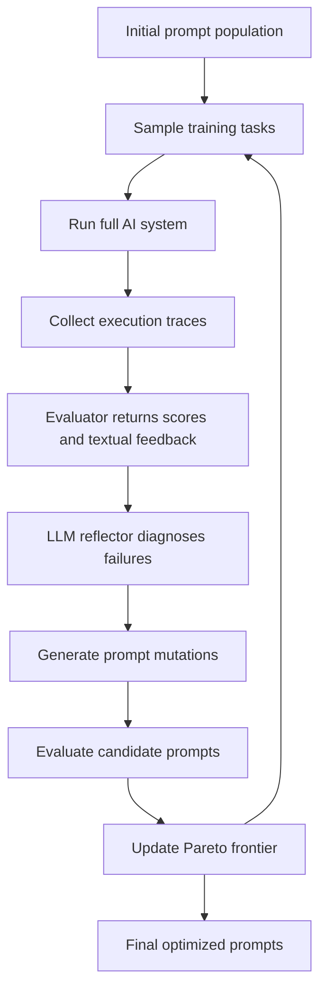

# Automatic Prompt Optimization: From Handcrafted Prompts to Reflective Evolution

> 🧬 *"A good prompt is not written once; it is evolved through feedback. The future of Prompt Engineering is not better intuition alone, but systems that can observe failures, reflect in language, and rewrite themselves."*

In the previous sections, we learned how to write prompts, choose prompting strategies, call model APIs, tune model parameters, and prepare training data. But in real Agent systems, prompt quality still depends heavily on a small number of experts.

This creates a serious engineering bottleneck:

- A complex Agent may contain **many prompts**: planner prompts, tool-selection prompts, retrieval prompts, verifier prompts, summarizer prompts, memory prompts, safety prompts, and output-format prompts.
- Changing one prompt may affect the behavior of other modules.
- Manual prompt tuning is slow, subjective, and hard to reproduce.
- Reinforcement learning can improve behavior, but often requires expensive model training and large numbers of rollouts.

**Automatic Prompt Optimization** is the attempt to solve this bottleneck: instead of relying on humans to repeatedly edit prompts by intuition, we build a loop where the system runs tasks, collects feedback, diagnoses failures, proposes prompt mutations, evaluates candidates, and keeps the best variants.

This section focuses on one representative frontier method: **GEPA — Genetic-Pareto Prompt Evolution through Reflection**. It shows how prompt optimization can move from "try a few versions manually" to an engineering discipline based on traces, textual feedback, and evolutionary search.

---

## Why Do We Need Automatic Prompt Optimization?

Prompt Engineering works well when the task is simple and the prompt is short. But production Agents are not one prompt — they are **prompt ecosystems**.

Consider a document-analysis Agent:

| Module | Example Prompt Responsibility | Failure Mode |
|--------|-------------------------------|--------------|
| **Query analyzer** | Understand user intent and extract constraints | Misclassifies intent or ignores hidden requirements |
| **Retriever** | Generate search queries and choose documents | Retrieves irrelevant documents |
| **Reader** | Extract evidence from documents | Misses key evidence or over-trusts weak evidence |
| **Reasoner** | Combine evidence into an answer | Makes unsupported jumps |
| **Verifier** | Check factual consistency and format | Fails to catch hallucinations |
| **Formatter** | Produce final JSON / report / citation format | Breaks schema or mixes explanation into structured output |

If the final answer is wrong, which prompt should we edit?

A human expert may inspect the trace and say:

> "The retriever prompt is too broad; it should force the model to preserve entity names and dates. The verifier prompt also needs a stricter evidence-grounding rule."

Automatic prompt optimization tries to make this process systematic. Instead of asking an expert to manually inspect every failure, we let an optimizer use **execution traces** and **natural-language feedback** to decide what to change.

---

## The Core Idea: Treat Prompts as Text Parameters

In neural-network training, model weights are numerical parameters. We update them using gradients.

In prompt optimization, prompts are **text parameters**. We cannot compute numerical gradients over natural language directly, but we can still optimize them through feedback:

```text
Initial Prompt
     ↓
Run on training tasks
     ↓
Collect outputs, scores, traces, and textual feedback
     ↓
Reflect: what went wrong and why?
     ↓
Mutate the prompt
     ↓
Evaluate candidate prompts
     ↓
Keep strong and complementary candidates
     ↓
Repeat
```

The key shift is this:

> **Instead of compressing feedback into only a scalar reward, use language itself as the learning signal.**

A number like `0.6` tells us that a prompt is mediocre. A textual critique tells us *why*:

```text
The model often answers before checking whether the retrieved document actually supports the claim.
The prompt should require explicit evidence matching before final answer generation.
```

This critique is much more useful for rewriting a prompt.

---

## GEPA in One Sentence

**GEPA** can be understood as:

> A prompt optimizer that samples execution traces from an AI system, uses natural-language reflection to diagnose failures and propose prompt mutations, and preserves a Pareto frontier of complementary prompt candidates instead of only keeping the single highest-average scorer.

The name highlights three ideas:

| Term | Meaning | Why It Matters |
|------|---------|----------------|
| **Genetic** | Maintain a population of candidate prompts and repeatedly mutate / combine them | Avoids getting stuck in one local style of prompt |
| **Pareto** | Keep candidates that are strong on different subsets of examples | Preserves diversity and handles heterogeneous tasks |
| **Prompt Evolution** | Prompts are not fixed artifacts; they improve through runtime feedback | Turns prompt tuning into an optimization loop |

GEPA is especially useful when:

- The model weights cannot be changed.
- Full system rollouts are expensive.
- The AI system has multiple LLM modules.
- Evaluators can provide not only scores but also textual feedback.
- Failures are easier to diagnose from traces than from final answers alone.

---

## Inputs and Outputs of a Prompt Optimizer

A practical automatic prompt optimizer usually needs five inputs:

| Input | Description | Example |
|-------|-------------|---------|
| **AI system** | The LLM application to optimize; may contain one or many prompt-bearing modules | RAG pipeline, coding Agent, math solver, customer-service workflow |
| **Training set** | Tasks used for optimization | Questions, documents, user requests, code problems |
| **Metric** | Quantitative objective | Accuracy, F1, unit-test pass rate, task success rate, format validity |
| **Feedback function** | Evaluator that returns natural-language critique, not just a score | "The answer cited document A, but the required evidence is in document C." |
| **Rollout budget** | Maximum number of expensive full-system runs | 100, 500, 2,000 rollouts |

The output is not a new model. It is an optimized set of prompts:

```text
Before optimization:
  planner_prompt_v0
  retriever_prompt_v0
  verifier_prompt_v0

After optimization:
  planner_prompt_v7
  retriever_prompt_v4
  verifier_prompt_v9
```

This distinction is important: **prompt optimization changes text parameters, not model weights**.

---

## GEPA Workflow: Reflective Prompt Evolution

A simplified GEPA-style workflow looks like this:



Let's unpack the most important components.

### 1. Execution Trace Collection

A **trace** is the complete record of what happened during a run. In an Agent system, it may include:

- User input
- Intermediate reasoning
- Tool calls
- Tool outputs
- Retrieved documents
- Module-level prompts and outputs
- Verifier judgments
- Final answer
- Error messages
- Evaluation feedback

For example, a RAG trace may look like this:

```text
Question: Which company acquired X in 2021?

Retriever Query:
  "X acquisition"

Retrieved Documents:
  Doc 1: mentions a 2019 investment
  Doc 2: mentions a 2021 acquisition by Company Y

Reader Output:
  "Company Z acquired X."

Evaluator Feedback:
  "Incorrect. The supporting document states Company Y, not Company Z.
   The reader ignored the sentence with the exact acquisition date."
```

A scalar score only says `0`. The trace tells us where the failure happened.

### 2. Natural-Language Reflection

The optimizer then asks an LLM to inspect traces and write a diagnosis:

```text
The current reader prompt does not force the model to align extracted entities with dates.
It tends to use the first familiar company name rather than the sentence containing the target year.
Add a rule: when the question includes a year, select evidence from sentences that explicitly mention that year.
```

This diagnosis becomes a **textual learning signal**.

### 3. Prompt Mutation

Based on the reflection, the optimizer rewrites one or more prompts:

```text
Original reader rule:
  Extract the answer from the retrieved documents.

Mutated reader rule:
  Extract the answer only from sentences that directly support the requested relation.
  If the question contains a date or year, prioritize sentences that explicitly mention the same date or year.
  Quote the supporting sentence before producing the final answer.
```

Unlike random prompt rewriting, the mutation is grounded in concrete failures.

### 4. Candidate Evaluation

Each mutated prompt must be evaluated on held-out or mini-batch examples. The optimizer records:

- Score on each example
- Cost and latency
- Which failure types improved
- Which failure types regressed
- Textual feedback from evaluators

This step prevents the optimizer from accepting prompts that merely sound better.

### 5. Pareto Frontier Selection

A naive optimizer keeps only the candidate with the highest average score. GEPA-style selection is more subtle: it keeps a **Pareto frontier**.

Suppose we have three prompts evaluated on three task categories:

| Prompt | Multi-hop QA | Math | Instruction Following | Average |
|--------|--------------|------|------------------------|---------|
| `P1` | 90 | 40 | 70 | 66.7 |
| `P2` | 70 | 85 | 55 | 70.0 |
| `P3` | 60 | 60 | 92 | 70.7 |

If we only keep the highest average, we keep `P3`. But `P1` is much better at multi-hop QA, and `P2` is much better at math. These prompts contain complementary knowledge.

A Pareto strategy keeps candidates that are not dominated across dimensions. This preserves diversity and gives the optimizer more material for future mutation or merging.

> 💡 **Key insight**: In heterogeneous Agent tasks, there may not be one universally best prompt. A prompt that is excellent for one class of examples may encode a useful rule that should not be discarded just because its average score is lower.

---

## A Minimal GEPA-Style Optimizer in Python

The following toy implementation is not a full GEPA reproduction. Its purpose is to show the engineering shape of reflective prompt optimization.

```python
from dataclasses import dataclass
from typing import Callable, Any


@dataclass
class Example:
    input: str
    expected: str


@dataclass
class EvalResult:
    score: float
    feedback: str
    output: str


@dataclass
class PromptCandidate:
    prompt: str
    scores: list[float]
    feedback: list[str]


def run_system(prompt: str, example: Example, llm_call: Callable[[str, str], str]) -> str:
    """Run one prompt-bearing module on one example."""
    return llm_call(prompt, example.input)


def evaluate_output(output: str, example: Example) -> EvalResult:
    """A simple evaluator. Real systems should use task-specific metrics and textual feedback."""
    is_correct = example.expected.lower() in output.lower()
    score = 1.0 if is_correct else 0.0
    feedback = "Correct." if is_correct else (
        "Incorrect. The output does not contain the expected answer. "
        "The prompt may need stricter evidence extraction or answer-format rules."
    )
    return EvalResult(score=score, feedback=feedback, output=output)


def reflect_and_mutate(
    current_prompt: str,
    failed_examples: list[tuple[Example, EvalResult]],
    llm_call: Callable[[str, str], str],
) -> str:
    """Ask an LLM to diagnose failures and rewrite the prompt."""
    failure_report = "\n\n".join(
        f"Input: {ex.input}\nExpected: {ex.expected}\nOutput: {res.output}\nFeedback: {res.feedback}"
        for ex, res in failed_examples
    )

    meta_prompt = """
You are a prompt optimization expert.
Given the current prompt and several failed cases, do two things:
1. Diagnose the common failure pattern.
2. Rewrite the prompt to prevent this failure while preserving its original intent.

Return only the rewritten prompt.
"""

    optimizer_input = f"""
## Current Prompt
{current_prompt}

## Failed Cases
{failure_report}

## Rewritten Prompt
"""
    return llm_call(meta_prompt, optimizer_input)


def optimize_prompt(
    initial_prompt: str,
    train_set: list[Example],
    llm_call: Callable[[str, str], str],
    rounds: int = 5,
    batch_size: int = 8,
) -> PromptCandidate:
    """A minimal reflective prompt optimization loop."""
    candidate = PromptCandidate(prompt=initial_prompt, scores=[], feedback=[])

    for step in range(rounds):
        batch = train_set[step * batch_size : (step + 1) * batch_size]
        if not batch:
            break

        results: list[tuple[Example, EvalResult]] = []
        for example in batch:
            output = run_system(candidate.prompt, example, llm_call)
            result = evaluate_output(output, example)
            results.append((example, result))

        candidate.scores.extend(result.score for _, result in results)
        candidate.feedback.extend(result.feedback for _, result in results)

        failed = [(ex, result) for ex, result in results if result.score < 1.0]
        if not failed:
            continue

        candidate.prompt = reflect_and_mutate(candidate.prompt, failed, llm_call)

    return candidate
```

In a real optimizer, we would add:

- Multiple prompt candidates instead of one candidate
- Module-level prompt selection for multi-stage systems
- Pareto-frontier maintenance
- Train / validation split
- Cost-aware evaluation
- Regression tests for safety and formatting
- Trace-level diagnosis instead of final-output-only feedback

---

## Multi-Prompt Optimization for Agent Systems

The most important difference between toy prompt tuning and production prompt optimization is **module interaction**.

A multi-module Agent may look like this:

```text
User Request
   ↓
Intent Classifier Prompt
   ↓
Planner Prompt
   ↓
Tool Selection Prompt
   ↓
Tool Execution
   ↓
Verifier Prompt
   ↓
Final Response Prompt
```

If the final response fails, the optimizer must decide which prompt to mutate. A practical strategy is to use trace attribution:

| Failure Pattern | Likely Prompt to Mutate |
|----------------|--------------------------|
| Wrong task type selected | Intent classifier prompt |
| Correct goal but bad decomposition | Planner prompt |
| Correct plan but wrong external action | Tool-selection prompt |
| Correct evidence but wrong conclusion | Reasoner prompt |
| Correct answer but invalid JSON | Formatter prompt |
| Unsafe instruction followed | Safety / policy prompt |

A GEPA-style optimizer is valuable because it can inspect the full trace rather than only the final output. This makes it possible to generate targeted mutations:

```text
Do not change the final-response prompt.
The error occurs earlier: the tool-selection module used web_search for a calculation task.
Mutate the tool-selection prompt to prefer calculator for arithmetic expressions.
```

---

## Comparison with Related Methods

Automatic prompt optimization has evolved rapidly. The following table summarizes several representative methods and how they relate to GEPA.

| Method | Core Idea | Strength | Limitation | Relation to GEPA |
|--------|-----------|----------|------------|------------------|
| **APE** | Ask LLMs to generate candidate prompts and select the best one on validation data | Simple and effective for early automatic prompt generation | Mostly single-stage; limited use of trace feedback | Shows that LLMs can write prompts automatically |
| **OPRO** | Put historical candidates and scores into a meta-prompt; ask the LLM to generate better candidates | Treats LLM as an optimizer | Relies heavily on final scores; little process diagnosis | Provides the "LLM as optimizer" framing |
| **ProTeGi** | Use textual critiques as "gradients" and rewrite prompts via beam search | Strong use of natural-language feedback | Mainly single-prompt optimization | One of the closest predecessors to GEPA |
| **TextGrad** | Organize textual feedback like automatic differentiation over computation graphs | General framework for text-based optimization | Broader and more abstract; not only prompts | Shares the idea that language can carry optimization signal |
| **EvoPrompt** | Apply evolutionary algorithms to prompt search | Strong exploration ability | Less focused on reflective trace diagnosis | Shares the evolutionary search component |
| **PromptBreeder** | Evolve both task prompts and mutation prompts | Self-referential improvement | More complex and less directly tied to execution traces | Shares self-improving prompt evolution ideas |
| **DSPy / MIPROv2** | Compile LM programs and optimize instructions plus few-shot demonstrations | Practical for modular LM pipelines | Often optimizes over combinations using scores rather than rich traces | GEPA can be seen as a reflective alternative or complement |
| **Trace** | Use execution traces and rich feedback to optimize generative systems | Very general; can optimize prompts, code, and parameters | Broader scope than prompt optimization | Shares the trace-as-optimization-signal philosophy |

The historical trend is clear:

```text
LLM generates prompts → LLM optimizes with scores → textual feedback → evolutionary search → multi-module trace reflection → Pareto prompt evolution
```

GEPA integrates several of these ideas into one coherent loop.

---

## GEPA vs. Reinforcement Learning

Why not just use RL?

Reinforcement learning methods such as GRPO can improve model behavior, but they often require many rollouts and may involve model-weight updates. GEPA targets a different regime:

| Dimension | Reinforcement Learning | GEPA-Style Prompt Optimization |
|----------|-------------------------|--------------------------------|
| What changes? | Model weights or policy parameters | Prompt text |
| Feedback type | Usually scalar reward, sometimes preference signal | Scores + natural-language feedback + traces |
| Sample efficiency | Often needs many rollouts | Designed to work with fewer expensive rollouts |
| Deployment complexity | Requires training infrastructure | Can be applied at application layer |
| Interpretability | Learned weights are hard to inspect | Prompt changes are human-readable |
| Best for | Deep behavioral adaptation, new strategies | Application-level behavior, format, workflow, tool-use policies |

The key argument behind GEPA is not that prompt optimization replaces RL everywhere. Rather:

> When the desired behavior can be expressed as better instructions, better constraints, better examples, or better module policies, prompt optimization is often cheaper, more interpretable, and easier to deploy than weight training.

---

## How to Design a Good Feedback Function

Automatic prompt optimization depends heavily on feedback quality. A weak evaluator produces weak prompt mutations.

A good feedback function should return both a score and an explanation:

```python
def evaluate_answer(question: str, prediction: str, reference: str) -> dict:
    """Example shape of a feedback function."""
    return {
        "score": 0.0,
        "feedback": """
The answer is incorrect because it cites the wrong entity.
The reference answer is Company Y, while the prediction says Company Z.
The model appears to rely on the first retrieved document instead of checking the document with the target year 2021.
Suggested prompt improvement: require evidence selection from sentences that explicitly match the requested date.
"""
    }
```

Useful feedback has four properties:

| Property | Good Feedback | Bad Feedback |
|----------|---------------|--------------|
| **Specific** | "The JSON is missing the `deadline` field." | "Bad output." |
| **Causal** | "The model ignored the retrieved document that contained the answer." | "The answer is wrong." |
| **Actionable** | "Require citation before final answer." | "Be more accurate." |
| **Localized** | "The planner chose the wrong tool." | "The Agent failed." |

For Agent systems, feedback should ideally identify the failing module, not only the final answer.

---

## Evaluation Design: Avoid Overfitting the Prompt

Prompt optimizers can overfit just like machine-learning models. If the optimizer repeatedly sees the same small training set, it may produce prompts that memorize the quirks of those examples.

A robust setup should include:

| Dataset Split | Purpose |
|---------------|---------|
| **Training set** | Used for prompt mutation and reflection |
| **Validation set** | Used for candidate selection and early stopping |
| **Test set** | Used only once for final reporting |
| **Regression set** | Critical examples that must never break |
| **Adversarial set** | Prompt injection, malformed input, edge cases |

For production Agent systems, also evaluate:

- **Format validity**: Does the output parse reliably?
- **Tool-use correctness**: Did the Agent choose appropriate tools?
- **Groundedness**: Are claims supported by evidence?
- **Safety compliance**: Did the prompt mutation weaken guardrails?
- **Cost**: Did a more accurate prompt dramatically increase token usage?
- **Latency**: Did the optimizer add excessive reasoning instructions?

> ⚠️ **Important**: A prompt optimizer should not be allowed to freely remove safety rules in order to improve task score. Safety prompts and policy constraints need separate regression tests or hard constraints.

---

## Practical Recipe: Applying GEPA-Style Optimization

Here is a practical workflow you can use when optimizing prompts in an Agent project.

### Step 1: Make Prompts Modular

Do not hide prompts inside long functions. Name them explicitly:

```python
PROMPTS = {
    "planner": "...",
    "tool_selector": "...",
    "verifier": "...",
    "final_answer": "...",
}
```

This allows the optimizer to mutate one module at a time.

### Step 2: Log Full Traces

A minimal trace should include:

```python
trace = {
    "input": user_request,
    "module_prompts": used_prompts,
    "module_outputs": intermediate_outputs,
    "tool_calls": tool_calls,
    "tool_results": tool_results,
    "final_output": final_output,
    "score": score,
    "feedback": textual_feedback,
}
```

Without traces, automatic optimization is blind.

### Step 3: Start with High-Value Failure Cases

Do not optimize on random data only. Include:

- Frequent production failures
- High-value business cases
- Edge cases that expose prompt ambiguity
- Safety-critical cases
- Format-sensitive cases

### Step 4: Use Small Batches and Cheap Models First

Prompt optimization can be expensive. A common pattern is:

1. Generate mutations using a strong model.
2. Evaluate candidates on small batches.
3. Eliminate obviously bad candidates early.
4. Run larger validation only for promising prompts.
5. Final-test the best candidate with the production model.

### Step 5: Keep Human Review in the Loop

Prompt optimization produces human-readable artifacts. Use that advantage:

- Review large prompt changes.
- Diff prompts before deployment.
- Check whether safety rules were weakened.
- Keep version history.
- Add regression examples when failures appear.

---

## Common Failure Modes

Automatic prompt optimization is powerful, but not magic.

| Failure Mode | Description | Mitigation |
|--------------|-------------|------------|
| **Evaluator hacking** | Prompt learns to satisfy the evaluator without solving the real task | Use multiple evaluators and hidden test sets |
| **Over-specific prompts** | Prompt becomes full of case-specific patches | Use validation diversity and prompt-length penalties |
| **Safety regression** | Optimizer removes constraints that reduce task score | Freeze safety rules or enforce policy regression tests |
| **Token bloat** | Prompt grows longer every round | Add compression steps and cost-aware scoring |
| **Module misattribution** | Optimizer mutates the wrong prompt | Use trace-level diagnosis and module-level feedback |
| **Non-deterministic evaluation** | Candidate ranking changes due to sampling variance | Use fixed seeds where possible, repeated runs, and confidence intervals |

A mature optimizer should optimize not only accuracy, but also simplicity, robustness, safety, and cost.

---

## From Prompt Evolution to Skill Evolution

GEPA optimizes prompts. But Agent systems can also improve by accumulating reusable skills.

This is related to methods such as:

- **Reflexion**: Store verbal reflections after failure and reuse them in later attempts.
- **ExpeL**: Extract general insights from successful and failed trajectories.
- **Voyager**: Store executable code skills in a skill library.
- **SkillRL / SkillX-style systems**: Build structured skill banks that evolve over time.

The relationship is straightforward:

```text
Prompt evolution improves how the Agent thinks and communicates.
Skill evolution improves what the Agent can reuse and execute.
```

They can reinforce each other. For example:

1. A skill library records common successful strategies.
2. GEPA-style optimization updates the planner prompt to retrieve and apply those skills more reliably.
3. New traces reveal missing skills.
4. The system adds new skills and further optimizes prompts around them.

In long-running Agent products, prompt evolution and skill evolution are likely to become one integrated self-improvement loop.

---

## When Should You Use Automatic Prompt Optimization?

Use it when:

- You already have a measurable task.
- You can collect representative examples.
- You can define a feedback function.
- Manual prompt tuning has become slow or inconsistent.
- The system has multiple prompt-bearing modules.
- Full model fine-tuning is too expensive or unnecessary.

Do not start with it when:

- You do not yet know what the Agent should do.
- There is no evaluation metric.
- Failures are mainly caused by missing tools or missing data.
- Safety policy is not clearly defined.
- The prompt is still a small prototype that can be manually improved quickly.

A practical rule:

> **First write a good prompt manually. Then build evaluation. Then automate optimization.**

Automatic prompt optimization amplifies engineering discipline; it does not replace it.

---

## Section Summary

| Topic | Key Points |
|-------|------------|
| **Problem** | Manual prompt tuning does not scale to complex multi-module Agent systems |
| **Core idea** | Treat prompts as text parameters and optimize them with traces, scores, and natural-language feedback |
| **GEPA** | Combines reflective prompt mutation, genetic search, and Pareto-frontier candidate selection |
| **Why language feedback matters** | Textual critique explains *why* a prompt failed, while scalar rewards only say *how much* it failed |
| **Pareto selection** | Preserves prompts that are strong on different task subsets, avoiding premature loss of useful rules |
| **Engineering requirements** | Modular prompts, full trace logging, good feedback functions, validation sets, regression tests |
| **Main risks** | Overfitting, evaluator hacking, safety regression, token bloat, and wrong module attribution |

Automatic Prompt Optimization marks an important transition: Prompt Engineering is no longer just an individual craft. It becomes a feedback-driven system that can observe its own failures, reflect in natural language, and evolve.

---

## References

1. Zhou et al. "GEPA: Reflective Prompt Evolution Can Outperform Reinforcement Learning." ICLR 2026.
2. Zhou et al. "Large Language Models Are Human-Level Prompt Engineers." ICLR 2023.
3. Yang et al. "Large Language Models as Optimizers." ICLR 2024.
4. Pryzant et al. "Automatic Prompt Optimization with Gradient Descent and Beam Search." EMNLP 2023.
5. Yuksekgonul et al. "TextGrad: Automatic Differentiation via Text." 2024.
6. Guo et al. "Connecting Large Language Models with Evolutionary Algorithms Yields Powerful Prompt Optimizers." ICLR 2024.
7. Fernando et al. "Promptbreeder: Self-Referential Self-Improvement via Prompt Evolution." ICML 2024.
8. Khattab et al. "Optimizing Instructions and Demonstrations for Multi-Stage Language Model Programs." EMNLP 2024.
9. Wang et al. "Trace is the Next AutoDiff: Generative Optimization with Rich Feedback, Execution Traces, and LLMs." 2024.
10. Shinn et al. "Reflexion: Language Agents with Verbal Reinforcement Learning." NeurIPS 2023.
11. Wang et al. "Voyager: An Open-Ended Embodied Agent with Large Language Models." 2023.

---

*Previous section: [3.8 SFT and Reinforcement Learning Training Data Preparation](./08_training_data.md)*

*Next chapter: [Chapter 4: Tool Use / Function Calling](../chapter_tools/README.md)*
