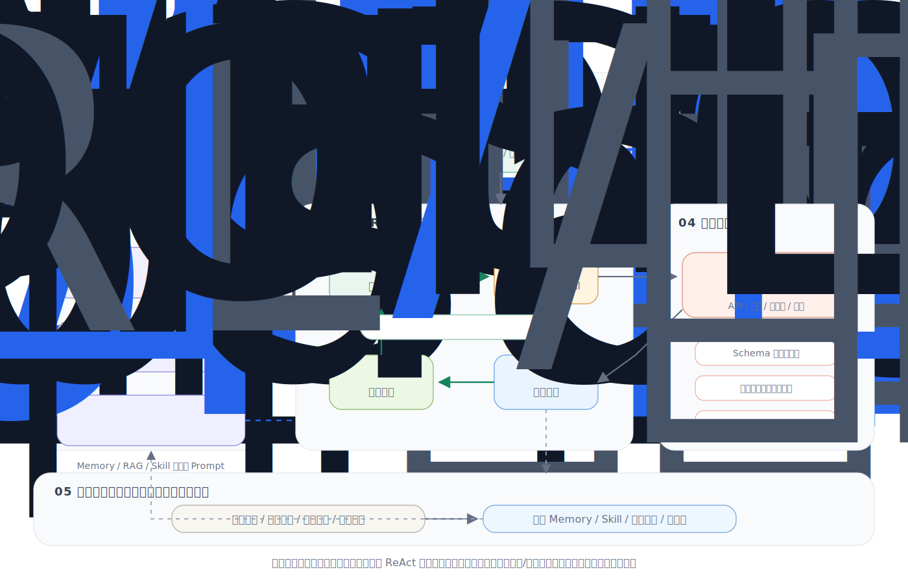

# 第1章 什么是 Agent？

> 🎯 *"Agent 不仅仅是一个聊天机器人，它是能够自主感知环境、做出决策并采取行动的智能实体。"*

## 本章概览

欢迎来到 Agent 开发的世界！在这一章中，我们将从最基础的概念出发，帮助你建立对 AI Agent 的全面理解。

如果你曾经使用过 ChatGPT、Claude 等对话式 AI，你可能会想："这些不就是 Agent 吗？" 实际上，它们之间有着本质的区别。一个真正的 Agent 不仅能"说话"，更能"做事"——它可以使用工具、访问数据库、调用 API、执行代码，甚至能制定计划并自我纠错。

本章将帮助你理解这些核心差异，并为后续的开发实战打下坚实的概念基础。

上图可以先帮你建立一个完整 Agent 直觉：用户提出目标后，系统会把任务、上下文、记忆、知识库和可用技能等一起组织成 Prompt，交给大语言模型进行推理和决策。模型不会只生成一次答案，而是会在 `Reason → Action → Observe → Update` 的循环中不断推进任务：先思考下一步，再调用工具或访问文件、API，随后根据外部反馈修正计划，直到产出最终结果。

其中，`Memory` 负责保存长期偏好、历史决策和可复用经验；`RAG` 负责从文档或知识库中检索可靠资料；`Skill 库` 则沉淀常见任务流程和工具使用方式。理解这张图后，你会更容易看清 Agent 与普通聊天机器人的区别：聊天机器人主要是在回答问题，而 Agent 是在带着目标、工具和反馈闭环持续完成任务。

## 🎓 学习目标

完成本章学习后，你将能够：

- ✅ 清晰地定义什么是 AI Agent
- ✅ 理解 Agent 从简单聊天机器人到复杂智能体的演进历程
- ✅ 掌握 Agent 的核心架构：感知-思考-行动循环
- ✅ 区分 Agent 与传统程序、聊天机器人的本质差异
- ✅ 了解 Agent 在各行各业的典型应用场景

## 📑 章节结构

## ⏱️ 预计学习时间

约 **45-60 分钟**（含思考练习）

## 💡 前置知识

- 无需任何 AI 或 Agent 的背景知识
- 了解基本的编程概念会有所帮助（但不是必须的）

---

## 🔗 学习路径

> **后续推荐**：
> - 👉 [第2章 大语言模型基础](../chapter_llm/README.md) — 理解 Agent 的"大脑"
> - 👉 [附录 F：开发环境搭建](../chapter_setup/README.md) — 搭好工具，开始动手

---

*准备好了吗？让我们从 Agent 的前世今生开始说起……*
