# 2.9 Prompt 自动调优：从手工提示词到自我进化的 Agent

> 🧬 *"一个好的 Prompt 不是一次写成的，而是在任务、反馈、失败和反思中不断进化出来的。未来的 Agent 不只是会回答问题，还会观察自己的失败，修改自己的工作方式，并把成功经验沉淀下来。"*

在前面的章节中，我们学习了 LLM 的工作原理、Prompt Engineering、常见提示策略、模型 API 调用、模型参数，以及 SFT / RL 训练数据准备。

这些方法能帮助我们写出更好的 Prompt，但在真实的 Agent 系统里，问题会变得更复杂：

- 一个 Agent 往往不是一个 Prompt，而是一组 Prompt。
- 规划、检索、工具选择、代码执行、验证、总结、记忆、安全策略，可能都有各自的 Prompt。
- 修改其中一个 Prompt，可能会影响其他模块。
- 手工调 Prompt 依赖少数专家经验，效率低、难复现、难规模化。
- 如果用强化学习改模型权重，又需要大量 rollout、训练基础设施和成本。

于是，一个新的方向出现了：**Prompt 自动调优（Automatic Prompt Optimization）**。

它想解决的问题很直接：

> 能不能让系统自己运行任务、发现失败、阅读反馈、反思原因、重写 Prompt，并保留更好的版本？

本节不是只介绍某一篇论文，而是对这个方向做一个整体综述。我们会从最容易理解的例子开始，逐步介绍：

- 为什么需要 Prompt 自动调优。
- Prompt 自动调优和强化学习有什么不同。
- APE、OPRO、ProTeGi、TextGrad、DSPy / MIPROv2、EvoPrompt、PromptBreeder、Trace 等方法分别解决了什么问题。
- 为什么 GEPA 是这个方向的一个集成型代表。
- Prompt 进化和 Skill 进化有什么关系。
- 如果要在真实 Agent 项目中落地，应该怎么做。

### 本节应该怎么读？

这一节内容比较长，因为 Prompt 自动调优不是一个单点技巧，而是一整套“让系统根据反馈改进自己”的工程方法。为了降低理解难度，可以按下面三层来读：

| 阅读层次 | 先关注什么 | 暂时可以先不深究什么 |
|----------|------------|----------------------|
| **第一遍：直觉层** | Prompt 自动调优就是“让系统自己看错题、改说明书” | 各论文之间的细微算法差别 |
| **第二遍：机制层** | 反馈、轨迹、候选生成、评估、选择分别起什么作用 | 具体实现中的优化细节 |
| **第三遍：工程层** | 如何在真实 Agent 中记录 trace、设计评估、控制风险 | 每个 benchmark 的实验细节 |

如果你刚接触这个方向，建议先抓住一句话：

> **Prompt 自动调优不是让模型凭空变聪明，而是把“发现问题 → 总结原因 → 修改提示词 → 再验证”的过程自动化。**

后面所有方法，基本都在回答四个问题：

```text
1. 怎么发现 Prompt 不好？
2. 怎么知道它为什么不好？
3. 怎么生成一个可能更好的 Prompt？
4. 怎么判断新 Prompt 是否真的更好？
```

---

## 先用一个生活类比理解 Prompt 自动调优

可以把 Prompt 想象成老师给学生写的“做题说明”。

比如老师让学生做阅读理解，最初只写了一句话：

```text
请阅读文章并回答问题。
```

学生经常答错。老师看了几次错题后发现：

- 学生经常不引用原文。
- 学生容易把自己的猜测当答案。
- 如果问题问的是时间，学生会忽略年份。

于是老师把说明改成：

```text
请先在文章中找到能直接支持答案的句子。
如果问题包含时间或年份，必须优先寻找包含相同时间或年份的句子。
最后回答时，只能使用原文支持的信息，不要猜测。
```

这就是一次手工 Prompt 优化。

Prompt 自动调优要做的事情，就是让系统自动完成类似过程：

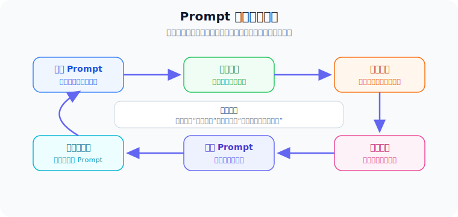

如果这个过程能自动循环，Prompt 就不再是写完就固定的文本，而会变成一种可以持续改进的“文本参数”。

### 一个贯穿全节的小例子：客服问答 Agent

为了让后面的概念更容易理解，我们先设定一个非常小的 Agent。它负责回答用户关于退款政策的问题。

最初它只有一个很简单的 Prompt：

```text
你是客服助手。请根据知识库回答用户问题。
```

用户问：

```text
我买的耳机已经签收 20 天了，还能退款吗？
```

知识库中有两条规则：

```text
规则 A：普通商品支持签收后 7 天无理由退款。
规则 B：质量问题商品支持签收后 30 天内申请售后。
```

Agent 错误回答：

```text
可以退款，因为 30 天内可以申请售后。
```

这个回答错在哪里？

- 用户没有说明耳机存在质量问题。
- Agent 把“售后”误当成了“退款”。
- Agent 没有区分“普通退款”和“质量问题售后”。

如果只给系统一个分数：

```text
score = 0
```

系统只能知道“错了”，但不知道怎么改。

如果给它一段文字反馈：

```text
回答错误。用户只说签收 20 天，没有提供质量问题证据。
当前 Prompt 没有要求区分“无理由退款”和“质量问题售后”。
建议加入规则：只有在用户明确提到质量问题时，才使用 30 天售后规则；否则应使用 7 天无理由退款规则。
```

系统就可以把 Prompt 改成：

```text
你是客服助手。请根据知识库回答用户问题。
回答前必须先判断用户咨询的是“无理由退款”还是“质量问题售后”。
如果用户没有明确说明质量问题，不要套用质量问题售后规则。
如果多个规则看起来相关，优先选择条件与用户描述完全匹配的规则。
```

这就是 Prompt 自动调优最核心的直觉：

> **用具体失败案例产生具体反馈，再把反馈转化成更清晰的 Prompt 规则。**

后面介绍的 APE、OPRO、ProTeGi、TextGrad、GEPA 等方法，复杂程度不同，但都可以放回这个小例子里理解。

---

## 为什么手工 Prompt 调优不够用了？

简单任务中，手工写 Prompt 通常已经够用。例如：

```text
请把下面这段话翻译成英文。
```

但真实 Agent 系统往往是多模块系统。以一个文档问答 Agent 为例：

| 模块 | Prompt 负责的事情 | 常见失败模式 |
|------|------------------|--------------|
| **查询分析器** | 理解用户到底想问什么 | 意图判断错误，忽略隐藏条件 |
| **检索器** | 生成搜索词，找到相关文档 | 搜到无关文档，漏掉关键文档 |
| **阅读器** | 从文档里抽取证据 | 漏看关键句，引用弱证据 |
| **推理器** | 把多个证据组合成答案 | 做出没有证据支撑的推理 |
| **工具选择器** | 决定是否调用搜索、计算器、代码执行器等工具 | 工具选错，或者该用工具时不用 |
| **验证器** | 检查答案是否可靠 | 没发现幻觉或格式错误 |
| **格式化器** | 输出 JSON、报告、引用格式 | 破坏 schema，混入多余解释 |
| **安全模块** | 拦截不安全请求 | 规则过松或过严 |

如果最终答案错了，我们应该改哪个 Prompt？

- 是检索 Prompt 太宽泛？
- 是阅读 Prompt 没要求引用证据？
- 是推理 Prompt 允许模型猜测？
- 是验证 Prompt 没有发现错误？
- 还是格式化 Prompt 把结构化输出弄坏了？

人类专家可以看执行过程来判断，但这很慢。系统越复杂，Prompt 越多，手工维护成本越高。

因此，Prompt 自动调优的目标不是替代所有人类判断，而是把"看失败、找原因、改 Prompt、再验证"这个流程工程化、自动化、可复现。

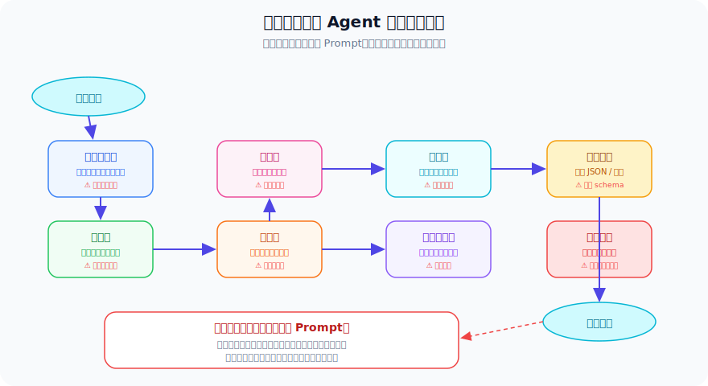

---

## Prompt 自动调优到底在优化什么？

在神经网络训练中，我们优化的是模型权重。权重是数字，所以可以用梯度下降更新。

在 Prompt 自动调优中，我们优化的是 Prompt 文本。Prompt 是自然语言，不能像数字一样直接求导，但它仍然可以通过反馈变得更好。

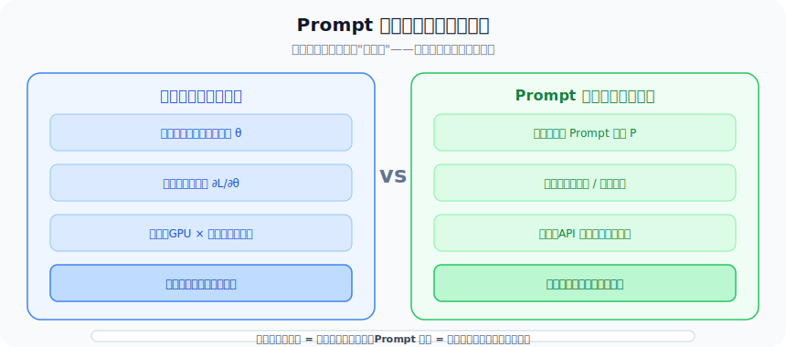

可以把两者对比如下：

| 项目 | 模型训练 / 强化学习 | Prompt 自动调优 |
|------|-------------------|----------------|
| 优化对象 | 模型权重或策略参数 | Prompt、instruction、few-shot 示例 |
| 是否修改模型 | 通常会修改 | 通常不修改 |
| 反馈形式 | 标量奖励、偏好数据、loss | 分数、文本反馈、执行轨迹 |
| 成本 | 通常较高 | 通常可以在应用层完成 |
| 可解释性 | 权重变化难解释 | Prompt diff 人类可读 |
| 适合场景 | 深层能力训练、新策略学习 | 应用层行为、格式、工具使用、工作流约束 |

一个最小的 Prompt 自动调优闭环如下：

```text
初始 Prompt
   ↓
在训练任务上运行系统
   ↓
收集输出、分数、错误案例和执行轨迹
   ↓
让 LLM 或评估器写出自然语言反馈
   ↓
根据反馈重写 Prompt
   ↓
评估新 Prompt
   ↓
保留表现更好的版本
   ↓
重复
```

把这个闭环拆开看，其实里面有四个角色：

| 角色 | 它做什么 | 类比 |
|------|----------|------|
| **执行者** | 按当前 Prompt 完成任务 | 做题的学生 |
| **评估者** | 判断答案好不好，给分数和反馈 | 批改作业的老师 |
| **改写者** | 根据反馈修改 Prompt | 修改讲义的老师 |
| **选择器** | 决定保留哪个 Prompt 版本 | 教研组选择新版教材 |

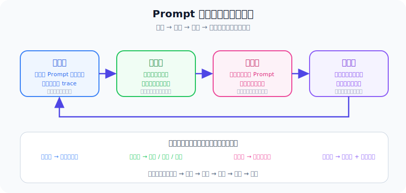

这四个角色可以由同一个 LLM 扮演，也可以由不同组件扮演。例如：

- 执行者使用便宜的小模型。
- 评估者使用规则、单测或人工标注。
- 改写者使用更强的模型。
- 选择器使用验证集分数、成本、延迟和安全检查共同判断。

所以 Prompt 自动调优并不等于“让一个模型随便改 Prompt”。更准确地说，它是一条有约束的工程流水线：

```text
执行 → 观察 → 解释 → 修改 → 验证 → 选择
```

这里最关键的思想是：

> **不要只把反馈压缩成一个数字，要尽量保留语言解释。**

例如，下面两个反馈都表示答案错了，但信息量完全不同：

```text
分数：0
```

和：

```text
答案错误。模型引用了文档 A，但真正支持答案的证据在文档 C。
问题问的是 2021 年的收购事件，模型却使用了 2019 年投资事件。
Prompt 应要求模型优先选择显式匹配年份的证据句。
```

第二种反馈更像老师批改作业。它不仅告诉你错了，还告诉你为什么错、该怎么改。

---

## 这个方向的发展脉络

Prompt 自动调优不是突然出现的。它大致经历了下面几步发展：

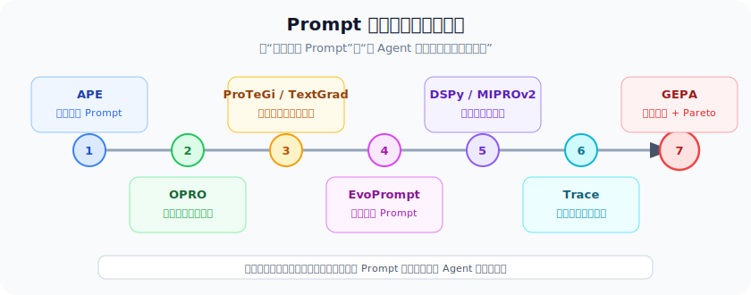

下面我们按方法类型来介绍。

### 从综述视角看：这个方向到底在研究什么？

如果不只看某一篇论文，而是看整个方向，Prompt 自动调优大致可以拆成四个问题：

| 研究问题 | 想解决什么 | 代表方法 |
|----------|------------|----------|
| **谁来写 Prompt？** | 从人工写 Prompt，变成让 LLM 自动生成候选 Prompt | `APE` |
| **怎么判断 Prompt 好不好？** | 从只看最终分数，变成结合验证集、文字反馈和执行轨迹 | `OPRO`、`ProTeGi`、`TextGrad` |
| **怎么搜索更好的 Prompt？** | 从单次改写，变成 beam search、贝叶斯优化、遗传进化、Pareto 选择 | `MIPROv2`、`EvoPrompt`、`PromptBreeder`、`GEPA` |
| **怎么让 Agent 长期变强？** | 从只改 Prompt，进一步沉淀经验、代码和技能库 | `Reflexion`、`Voyager`、`ExpeL`、`SkillRL`、`SkillX` |

所以，`GEPA` 不是孤立出现的。它更像是把前面几条路线组合起来：

```text
文本反馈思想：来自 ProTeGi / TextGrad
进化搜索思想：来自 EvoPrompt / PromptBreeder
多模块系统思想：来自 DSPy / Trace
长期经验沉淀思想：和 Reflexion / ExpeL / Voyager 等 Skill 方向相邻
```

也就是说，本节的重点不是“GEPA 这一种方法怎么用”，而是理解一个更大的趋势：

> **Agent 系统正在从人工调参，走向基于反馈、轨迹、反思和技能库的自动改进。**

---

## 第一类：自动生成 Prompt

### APE：让 LLM 自动写 Prompt

**APE** 的全名是 *Large Language Models Are Human-Level Prompt Engineers*，发表于 ICLR 2023。

它的想法很简单：既然 LLM 很会写文字，能不能让 LLM 自己给任务写 Prompt？

流程大致是：

```text
给 LLM 一些输入输出示例
   ↓
让 LLM 猜测这些示例背后的任务指令
   ↓
生成很多候选 Prompt
   ↓
在验证集上测试
   ↓
选择得分最高的 Prompt
```

例如，给模型几个例子：

```text
输入：I love this movie.
输出：positive

输入：This is terrible.
输出：negative
```

模型可能生成多个候选 Prompt：

```text
候选 1：判断下面句子的情感是 positive 还是 negative。
候选 2：分析文本的情感倾向，输出 positive 或 negative。
候选 3：阅读以下句子，判断说话者的态度是正面还是负面。
```

然后在验证集上分别测试这三个候选，保留得分最高的那个。

#### 用客服例子理解 APE

回到我们的客服问答 Agent。如果用 APE 来优化它，过程是：

```text
1. 准备一批"问题 → 正确答案"示例：

   "签收 7 天能退款吗？" → "可以，普通商品支持 7 天无理由退款。"
   "签收 20 天能退款吗？" → "不能，超过 7 天无理由退款期限。"
   "耳机有杂音能退吗？" → "可以申请售后，质量问题 30 天内可处理。"

2. 让 LLM 猜测这些示例背后的指令，生成候选 Prompt。

3. 在更多客服问题上测试每个候选 Prompt。

4. 保留得分最高的版本。
```

APE 可能生成类似这样的候选：

```text
候选 A：你是客服助手，请根据知识库回答退款相关问题。注意区分无理由退款和质量问题售后。
候选 B：请根据以下规则回答用户问题：7 天无理由退款，30 天质量问题售后。
```

可以看出，APE 已经能帮我们从零开始写出不错的 Prompt。但它止步于此——如果候选 A 在某些问题上仍然失败，APE 不会去分析为什么失败，也不会定向修改。

#### APE 的局限

| 局限 | 说明 |
|------|------|
| **单阶段** | 生成候选后只做一次筛选，不会迭代改进 |
| **只看分数** | 不知道为什么某个 Prompt 得分低 |
| **不分析过程** | 不关心模型中间推理是否合理 |
| **候选质量不可控** | LLM 可能生成看似合理但实际无效的 Prompt |

这些局限正是后续方法要解决的。OPRO 加入了迭代，ProTeGi 加入了文本反馈，GEPA 进一步加入了轨迹反思和进化搜索。

---

## 第二类：把 LLM 当优化器

### OPRO：把历史候选和分数写进 Prompt

**OPRO** 的全名是 *Large Language Models as Optimizers*，发表于 ICLR 2024。

它的核心想法是：把 LLM 当成一个优化器。

做法是把历史尝试写进一个 meta-prompt，让 LLM 观察"什么有效、什么无效"，然后提出新候选：

```text
你是一个 Prompt 优化器。下面是之前的尝试和对应得分：

候选 Prompt A："请回答用户的问题。" → 得分 62
候选 Prompt B："请根据给定资料回答问题。" → 得分 70
候选 Prompt C："请只根据给定资料回答问题，不要编造。" → 得分 68

得分越高越好。请根据以上历史结果，提出一个可能得分更高的新 Prompt。
```

LLM 会观察到 B 比 A 好说明"根据资料"这个约束有效，C 比 B 略低说明"不要编造"的表述可能过于严格或措辞不当。于是它可能生成：

```text
候选 Prompt D："请根据给定资料回答问题。如果资料中没有相关信息，请说明无法确定。"
```

这个过程可以反复迭代：每一轮把新的候选和分数追加到历史中，让 LLM 继续优化。

#### 用客服例子理解 OPRO

如果用 OPRO 优化客服 Agent：

```text
第 1 轮：
  候选 A："你是客服助手。请根据知识库回答用户问题。" → 得分 55

第 2 轮：
  候选 B："你是客服助手。请根据知识库回答用户问题。注意区分不同规则。" → 得分 63

第 3 轮：
  候选 C："你是客服助手。回答前先判断用户咨询的是退款还是售后，再选择对应规则。" → 得分 72

第 4 轮：
  候选 D："你是客服助手。回答前必须先判断用户咨询类型（无理由退款或质量问题售后），
           再选择匹配的规则。不要混淆不同类型的规则。" → 得分 78
```

OPRO 的优点是简单、通用，不需要训练模型。它让我们看到：**LLM 可以根据"候选 + 分数"进行黑盒优化**。

但它的弱点也很清楚：如果只看到分数，LLM 不知道错误发生在哪里。它知道 B 比 A 好，但不知道 A 为什么错。就像学生只看到考试分数，看不到自己哪道题做错了——虽然可以慢慢摸索，但效率不高。

#### APE → OPRO 的进步与不足

| 对比 | APE | OPRO |
|------|-----|------|
| **迭代** | 单阶段，生成后只筛选 | 多轮迭代，不断改进 |
| **历史信息** | 只看验证集分数 | 把历史候选和分数写进 meta-prompt |
| **优化方向** | 靠随机生成 | 靠 LLM 观察分数趋势 |
| **仍然缺少** | 不分析失败原因 | 也不分析失败原因 |

OPRO 比 APE 多了迭代，但仍然只看分数。下一步自然就是：能不能不只看分数，还告诉 LLM "你错在哪里"？这就是 ProTeGi 要做的。

---

## 第三类：文本反馈驱动的 Prompt 优化

### ProTeGi：文字版"梯度下降"

**ProTeGi** 的全名是 *Automatic Prompt Optimization with "Gradient Descent" and Beam Search*，发表于 EMNLP 2023。

它是 GEPA 最重要的思想来源之一。

我们知道，神经网络可以用梯度下降优化，因为参数是连续数字。但 Prompt 是一段自然语言，没法求数值梯度。

ProTeGi 提出一个很形象的想法：

> 能不能用自然语言批评来充当"文本梯度"？

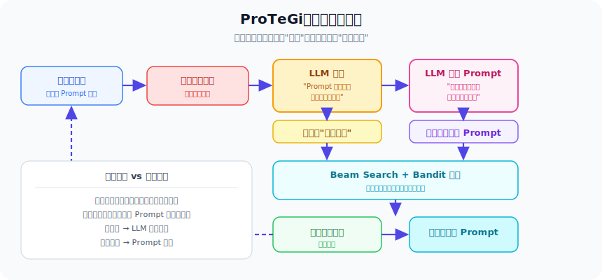

它的流程如下：

```text
拿当前 Prompt 跑一批训练样本
   ↓
找出答错的样本
   ↓
让 LLM 批评当前 Prompt 哪里没说清楚
   ↓
这段批评就是“文本梯度”
   ↓
让 LLM 根据批评反方向改写 Prompt
   ↓
生成多个候选 Prompt
   ↓
用 beam search 和 bandit 策略保留更有希望的候选
   ↓
继续迭代
```

举个例子，当前 Prompt 是：

```text
请回答用户的问题。
```

错误案例显示模型经常编造答案。LLM 写出的“文本梯度”可能是：

```text
当前 Prompt 没有要求模型区分已知信息和未知信息。
它也没有要求模型在证据不足时拒绝回答。
```

于是新 Prompt 可能变成：

```text
请只根据给定资料回答问题。
如果资料中没有足够证据，请明确说明无法确定，不要编造。
```

ProTeGi 的价值在于，它把"批评"变成了可操作的优化信号。

#### 用客服例子理解 ProTeGi

用 ProTeGi 优化客服 Agent 时，流程会更细：

```text
第 1 步：用当前 Prompt 跑一批客服问题

第 2 步：找到答错的问题

  问题："签收 20 天能退款吗？"
  模型回答："可以退款，30 天内可以申请售后。"
  参考答案："不能退款，超过 7 天无理由退款期限。"

第 3 步：让 LLM 批评当前 Prompt

  "当前 Prompt 没有要求区分'无理由退款'和'质量问题售后'。
   模型把两个规则混在一起，看到 30 天就用了售后规则。
   应该要求先判断用户咨询类型。"

第 4 步：这段批评就是"文本梯度"

第 5 步：让 LLM 根据批评反方向改写 Prompt

  新 Prompt："你是客服助手。回答前必须先判断用户咨询的是
  '无理由退款'还是'质量问题售后'，再选择对应规则。"

第 6 步：在更多问题上测试新 Prompt

第 7 步：用 beam search 保留表现最好的几个候选，继续迭代
```

#### 什么是 beam search？

ProTeGi 不只生成一个候选 Prompt，而是生成多个。然后用 beam search 策略逐步淘汰：

```text
轮次 1：生成 5 个候选 → 测试 → 保留得分最高的 3 个
轮次 2：对 3 个候选分别再生成变异 → 得到约 15 个 → 测试 → 保留最好的 3 个
轮次 3：继续变异 → 继续筛选 ...
```

这就像下棋时不是只算一步，而是同时考虑多条路径，保留最有希望的几条继续探索。

#### "文本梯度"和数值梯度的类比

| 类比 | 数值梯度 | 文本梯度 |
|------|----------|----------|
| **形式** | 一个向量，指出参数应该往哪个方向调 | 一段文字，指出 Prompt 哪里没说清楚 |
| **方向** | 负梯度方向 = 参数应减小的方向 | 批评 = Prompt 应修正的方向 |
| **步长** | 学习率控制调多大 | LLM 的改写力度控制改多少 |
| **迭代** | 梯度下降反复更新参数 | 反复批评和改写 Prompt |

ProTeGi 证明了：虽然 Prompt 不是数字，但只要能把"错在哪里"用文字说清楚，就能做类似梯度下降的优化。

它和 GEPA 的关系非常近：

| 对比点 | ProTeGi | GEPA |
|--------|---------|------|
| 优化对象 | 主要是单个 Prompt | 可以是多模块 AI 系统中的多个 Prompt |
| 反馈来源 | 错误样本和文本批评 | 执行轨迹、分数、评估器文本反馈 |
| 候选选择 | Beam search，偏向高分候选 | Pareto 前沿，保留互补候选 |
| 关注重点 | 文本梯度 | 轨迹反思 + 进化搜索 |

可以把 GEPA 理解为：在 ProTeGi 的“文本梯度”思想上，进一步加入了多模块轨迹、进化搜索和 Pareto 选择。

### TextGrad：像自动微分一样传播文字反馈

**TextGrad** 的全名是 *TextGrad: Automatic Differentiation via Text*，发表于 2024。

它的想法更抽象：既然 PyTorch 可以把数值梯度沿计算图反向传播，那么能不能把文字反馈也组织成类似的“反向传播”？

在 TextGrad 中，优化对象不一定只是 Prompt，也可以是：

- 一个中间答案。
- 一段解释。
- 一个工具调用计划。
- 一个多步骤推理链。
- 一个系统中的多个文本变量。

它把每个文本变量都看成可优化对象，然后让评估反馈沿着系统结构反向传递。

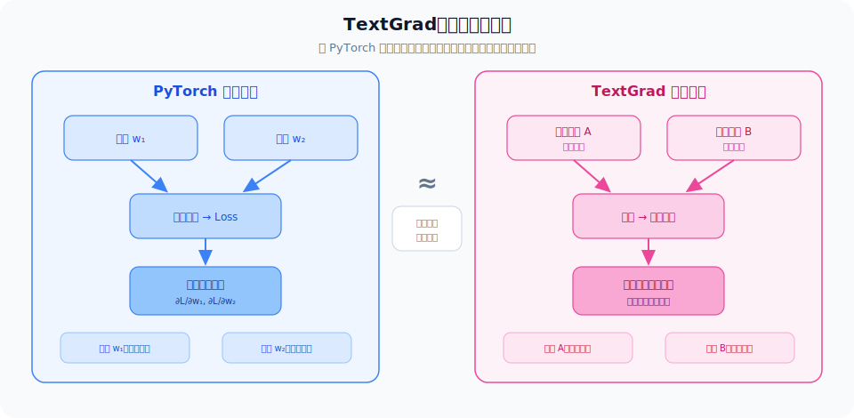

#### 用一个例子理解 TextGrad 的"反向传播"

假设有一个两步推理系统：

```text
步骤 1：生成初步答案（文本变量 A）
步骤 2：根据初步答案写最终报告（文本变量 B）
```

评估器对最终报告给出反馈：

```text
最终报告的数据分析有误，因为初步答案中混淆了两组数据。
```

TextGrad 会把这个反馈"反向传播"到文本变量 A：

```text
对变量 B 的反馈：报告数据混淆。
对变量 A 的反馈：初步答案混淆了两组数据，应分别处理。
```

然后用这些反馈分别修改 A 和 B：

```text
A 的新版本：明确区分两组数据，分别列出。
B 的新版本：基于修正后的初步答案重新组织报告。
```

这和 PyTorch 的自动微分非常类似，只是梯度从"数字向量"变成了"自然语言批评"。

| 类比 | PyTorch | TextGrad |
|------|---------|----------|
| **计算图** | 前向传播产生数值 | 前向传播产生文本 |
| **反向传播** | 链式法则求数值梯度 | LLM 沿依赖关系生成文字反馈 |
| **更新** | 参数 ← 参数 - lr × 梯度 | 文本 ← LLM 根据反馈改写文本 |
| **优化对象** | 权重、偏置 | Prompt、中间答案、推理链、计划等 |

TextGrad 和 GEPA 的共同点是：都认为自然语言可以承载优化信号。

区别是：

- TextGrad 更像一个通用框架，强调“文本自动微分”。
- GEPA 更聚焦 Prompt 优化，强调“轨迹反思 + 进化选择”。

---

## 第四类：进化算法做 Prompt 搜索

### EvoPrompt：把遗传算法搬到 Prompt 上

**EvoPrompt** 的全名是 *Connecting Large Language Models with Evolutionary Algorithms Yields Powerful Prompt Optimizers*，发表于 ICLR 2024。

它把 Prompt 优化看成一种进化过程：

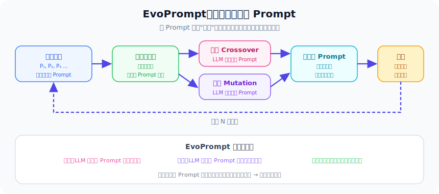

```text
一批 Prompt 候选
   ↓
评估每个候选的适应度
   ↓
选择表现好的候选
   ↓
交叉、变异，生成新候选
   ↓
继续筛选
```

这和生物进化很像：

- Prompt 候选就像不同个体。
- 分数就是适应度。
- 改写 Prompt 就像基因变异。
- 合并两个 Prompt 的优点就像基因交叉。

EvoPrompt 的贡献是把经典进化算法用于 Prompt 搜索。

#### 进化操作具体怎么做？

**变异**：选一个 Prompt，让 LLM 稍微改写它。

```text
原 Prompt："请回答用户的问题。"
变异后："请根据给定资料回答用户的问题，不要编造信息。"
```

**交叉**：选两个 Prompt，让 LLM 合并它们的优点。

```text
父本 A："请根据知识库回答用户问题。"
父本 B："回答前先判断用户咨询类型。"

交叉后："请根据知识库回答用户问题。回答前先判断用户咨询类型，再选择对应规则。"
```

每轮进化后，用验证集评估所有候选的适应度（分数），淘汰表现差的，保留表现好的，再继续变异和交叉。

这种方法的优点是：不需要理解 Prompt 为什么好或差，只需要有分数就够了。缺点是：搜索可能比较盲目，需要大量候选才能碰到好的。

### PromptBreeder：连“变异规则”也一起进化

**PromptBreeder** 的全名是 *Promptbreeder: Self-Referential Self-Improvement via Prompt Evolution*，发表于 ICML 2024。

它更进一步：不只进化任务 Prompt，还进化“如何修改 Prompt 的 Prompt”。

也就是说，系统里有两类 Prompt：

```text
任务 Prompt：告诉模型怎么完成任务。
变异 Prompt：告诉模型怎么改任务 Prompt。
```

PromptBreeder 让这两类 Prompt 一起进化，因此带有一种"自指式改进"的味道。

#### 具体例子

初始变异 Prompt 可能是：

```text
请把下面的指令改得更简洁。
```

但如果这个变异方向总让 Prompt 变得太短、丢失关键规则，那么这个变异 Prompt 自己也会被淘汰。系统可能会进化出这样的变异 Prompt：

```text
请在下面的指令中加入更具体的步骤和判断条件，但不要删除已有规则。
```

这就像是：不只是"改教材"，而是"改改教材的方法"也在改进。

这说明 Prompt 优化已经不只是“搜索一句更好的指令”，而是在探索系统如何改进自己的改进方法。

---

## 第五类：多模块 LLM 程序优化

### DSPy：从手写 Prompt 到编译 LLM 程序

**DSPy** 是 Stanford 开源的 LLM 编程框架。它背后的思想是：

> 不要把 LLM 应用写成一堆手工 Prompt，而是写成模块化程序，再让框架自动优化 Prompt 和示例。

比如一个 RAG 系统可能有三个模块：

```text
问题改写器 → 检索器 → 答案生成器
```

在传统写法中，开发者要为每个模块手写 Prompt。

在 DSPy 中，开发者更关注输入输出签名，例如：

```text
输入：question
输出：answer, evidence
```

框架会根据模块结构、训练数据和评估指标，自动寻找更好的 instruction 和 few-shot examples。

#### 一个最小 DSPy 代码示例

下面这个例子展示了 DSPy 的基本风格。不需要看懂每一行，重点是感受"声明式"和"模块化"的思路：

```python
import dspy

# 定义模块签名：输入什么、输出什么
class QASignature(dspy.Signature):
    """根据上下文回答问题。"""
    context: str = dspy.InputField(desc="检索到的文档")
    question: str = dspy.InputField(desc="用户问题")
    answer: str = dspy.OutputField(desc="基于证据的答案")

# 组装模块化程序
class RAGProgram(dspy.Module):
    def __init__(self):
        self.retriever = dspy.Retrieve(k=3)
        self.generator = dspy.ChainOfThought(QASignature)

    def forward(self, question):
        context = self.retriever(question).passages
        return self.generator(context=context, question=question)

# 编译优化：框架自动寻找更好的 instruction 和 few-shot
optimizer = dspy.MIPROv2(metric=accuracy_metric, num_threads=4)
optimized_program = optimizer.compile(
    RAGProgram(),
    trainset=train_examples,
    max_bootstrapped_demos=3,
    max_labeled_demos=3,
)
```

注意几个关键点：

- 开发者没有手写任何 Prompt，只定义了输入输出签名。
- `ChainOfThought` 是 DSPy 内置的推理策略模块。
- `MIPROv2` 编译器会自动生成和优化 instruction 和 few-shot。
- 优化后的 program 可以直接用于推理。

这和传统"手写大段 Prompt 字符串"的方式完全不同。

### MIPROv2：优化 instruction 和 few-shot 的组合

**MIPROv2** 是 DSPy 中常用的优化器，对应论文 *Optimizing Instructions and Demonstrations for Multi-Stage Language Model Programs*，发表于 EMNLP 2024。

它要优化的是：

```text
instruction × few-shot examples
```

也就是：

- 每个模块该写什么指令。
- 每个模块该配哪些示例。

大致流程是：

```text
用初始系统跑训练集
   ↓
保留成功样例，作为 few-shot 候选
   ↓
让 LLM 根据数据摘要和程序结构生成候选 instruction
   ↓
组合 instruction 和 few-shot
   ↓
小批量评估候选
   ↓
用贝叶斯优化搜索更好的组合
   ↓
在验证集上选择最终版本
```

MIPROv2 的优势是适合模块化 LM pipeline，并且能同时优化指令和示例。

它和 GEPA 的区别是：

| 对比点 | MIPROv2 | GEPA |
|--------|---------|------|
| 优化空间 | instruction × few-shot examples | Prompt 文本变异和组合 |
| 搜索方式 | 贝叶斯优化 | 反思式进化搜索 |
| 反馈利用 | 更多依赖最终分数 | 利用完整 trace 和文本反馈 |
| 强项 | 模块化程序编译优化 | 失败诊断和针对性 Prompt 改写 |

两者并不矛盾。GEPA 后来也可以被集成到 DSPy 生态中，作为一种更重视轨迹反思的优化器使用。

---

## 第六类：轨迹驱动的通用优化

### Trace：把执行轨迹当成优化信号

**Trace** 的全名是 *Trace is the Next AutoDiff: Generative Optimization with Rich Feedback, Execution Traces, and LLMs*，发表于 2024。

它提出一个更宽的观点：

> 对复杂 AI 系统来说，执行轨迹就像新的“计算图”。如果我们能记录系统每一步做了什么，就能利用这些轨迹优化系统。

这里的轨迹不只是最终答案，而是完整过程：

- 用户输入。
- 每个模块的 Prompt。
- 每个模块的输出。
- 工具调用。
- 工具返回结果。
- 中间推理。
- 错误信息。
- 最终输出。
- 评估反馈。

#### 一个具体的轨迹示例

下面是一个文档问答 Agent 的完整轨迹：

```text
=== 轨迹 #042 ===

[输入]
用户问题："2021 年哪家公司收购了 X 公司？"

[模块 1：查询改写器]
Prompt："把用户问题改写成适合检索的查询。"
输出："X company acquisition 2021"

[模块 2：检索器]
查询："X company acquisition 2021"
返回文档：
  - 文档 1：2019 年，Z 公司对 X 公司投资了 500 万美元
  - 文档 2：2021 年，Y 公司以 3 亿美元收购了 X 公司

[模块 3：阅读器]
Prompt："从检索到的文档中抽取答案。"
输出："Z 公司收购了 X 公司。"

[评估]
分数：0
反馈："错误。阅读器使用了文档 1（2019 年投资），
       而不是文档 2（2021 年收购）。应优先匹配年份。"
```

如果只看最终分数，我们只知道"错了"。如果看轨迹，我们知道：查询改写没问题，检索也找到了正确文档，问题出在阅读器——它选错了文档。这就是 trace 的价值。

Trace 的优化对象可以很广：

- Prompt。
- 代码。
- 超参数。
- 工具调用策略。
- 工作流结构。

GEPA 和 Trace 都重视 trace，但 GEPA 更聚焦于 Prompt 优化这个子问题。

---

## GEPA：这个方向的集成型代表

现在我们可以更好地理解 GEPA。

**GEPA** 的全名是 *Genetic-Pareto Prompt Evolution through Reflection*，论文标题是 *GEPA: Reflective Prompt Evolution Can Outperform Reinforcement Learning*，发表于 ICLR 2026。

一句话理解 GEPA：

> GEPA 是一种 Prompt 优化器。它让系统运行任务，收集完整执行轨迹，再让 LLM 用自然语言反思失败原因，生成 Prompt 变异，并用 Pareto 前沿保留不同场景下表现强的候选 Prompt。

GEPA 这个名字里有三个关键词：

| 关键词 | 含义 | 为什么重要 |
|--------|------|------------|
| **Genetic** | 遗传式搜索，维护一组候选 Prompt，不断变异和筛选 | 避免只盯着一个 Prompt 版本，减少局部最优 |
| **Pareto** | 帕累托选择，不只保留平均分最高的候选 | 保留在不同样本子集上各有优势的 Prompt |
| **Prompt Evolution** | Prompt 会随着反馈持续进化 | Prompt 不再是一次性手工产物 |

---

## GEPA 要解决什么问题？

GEPA 针对的是这样的场景：

- 有一个复杂 AI 系统，里面包含一个或多个 LLM Prompt。
- 不想或不能修改模型权重。
- 每次完整运行系统都很贵，因为可能涉及模型调用、检索、工具执行、代码运行等。
- 只看最终分数不够，需要知道中间哪里失败。
- 希望用尽量少的 rollout 得到更好的效果。

以前常见做法有两类：

| 做法 | 问题 |
|------|------|
| 人工调 Prompt | 依赖专家经验，效率低，难复现 |
| 强化学习改模型权重 | rollout 多，成本高，训练和部署复杂 |

GEPA 的选择是第三条路：

> 不改模型权重，而是在应用层自动改 Prompt；不靠大量盲目试错，而是利用语言反思提高样本效率。

---

## GEPA 的输入和输出

GEPA 的输入通常包括五类：

| 输入 | 说明 | 例子 |
|------|------|------|
| **AI 系统** | 待优化的系统，可能包含多个 LLM 模块 | RAG、编程 Agent、客服工作流、数学求解器 |
| **训练集** | 用于优化的任务集合 | 问题、文档、代码题、用户请求 |
| **评估指标** | 定量目标 | Accuracy、F1、单测通过率、任务成功率 |
| **反馈函数** | 能返回文字批评的评估器 | “答案引用了错误文档，应检查年份匹配。” |
| **Rollout 预算** | 最多允许完整运行多少次系统 | 100、500、2000 次 |

GEPA 的输出不是一个新模型，而是一组优化后的 Prompt：

```text
优化前：
  planner_prompt_v0
  retriever_prompt_v0
  verifier_prompt_v0

优化后：
  planner_prompt_v7
  retriever_prompt_v4
  verifier_prompt_v9
```

模型本身没有变，变的是系统中的文本参数。

---

## GEPA 的核心流程

一个简化版 GEPA 流程如下：

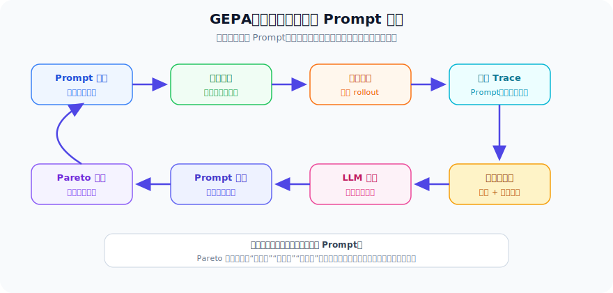

如果用更细的步骤描述，GEPA 可以理解成下面这个循环：

```text
1. 准备一组初始 Prompt 候选
2. 选择一个候选 Prompt，在一小批任务上运行系统
3. 记录每个任务的完整 trace
4. 用评估器给出分数和文字反馈
5. 让反思模型阅读 trace，判断失败原因
6. 选择最可能需要修改的模块 Prompt
7. 根据反思生成一个或多个 Prompt 变异
8. 评估新变异在不同样本上的表现
9. 把有价值的候选加入候选池
10. 用 Pareto 前沿保留互补的 Prompt 版本
11. 在预算用完前重复上述过程
```

可以把它想象成一个自动教研系统：

- 每个 Prompt 版本都是一本“教材”。
- 每个任务样本都是一道“练习题”。
- trace 是学生的完整解题过程。
- 文字反馈是老师的批改意见。
- Prompt 变异是教材修订版。
- Pareto 前沿是保留多本各有优势的教材，而不是只保留平均分最高的一本。

下面拆解其中最重要的组件。

### 1. 记录执行轨迹

**轨迹（trace）**是一轮运行中发生了什么的完整记录。在 Agent 系统中，它可能包括：

```text
用户输入
模块 Prompt
模块输出
工具调用
工具返回结果
检索文档
中间推理
验证结果
最终答案
评估分数
文字反馈
```

例如，一个 RAG 系统的失败轨迹可能是：

```text
问题：2021 年哪家公司收购了 X？

检索查询：
  "X acquisition"

检索到的文档：
  文档 1：提到 2019 年的一次投资
  文档 2：提到 2021 年 Company Y 对 X 的收购

阅读器输出：
  "Company Z 收购了 X。"

评估反馈：
  "错误。支持文档中写的是 Company Y，而不是 Company Z。
   阅读器忽略了包含准确年份 2021 的句子。"
```

如果只看最终分数，我们只知道这题错了。如果看轨迹，我们能知道错在哪里。

### 2. 用自然语言反思失败

优化器会让 LLM 读取轨迹，并写出类似下面的诊断：

```text
当前 reader prompt 没有强制模型把实体和年份对齐。
模型倾向于使用第一个看起来相关的公司名，而不是优先选择包含目标年份的证据句。
应加入规则：如果问题包含年份，必须优先使用显式提到同一年份的句子作为证据。
```

这段诊断就是高质量的学习信号。

它比一个 `0` 分更有用，因为它能指导 Prompt 应该怎么改。

为了更清楚地理解"反思"在做什么，可以把它拆成三层：

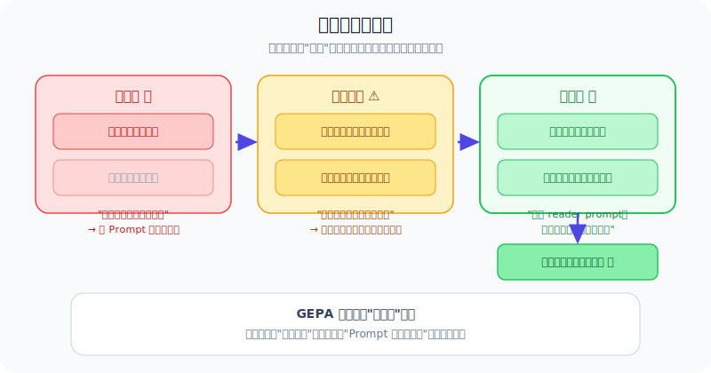

| 层次 | 要回答的问题 | 示例 |
|------|--------------|------|
| **现象层** | 输出哪里错了？ | "答案把 Company Z 写成了收购方。" |
| **原因层** | 为什么会这样错？ | "模型优先使用了第一篇文档，没有检查年份是否匹配。" |
| **修改层** | Prompt 应该增加什么约束？ | "要求回答前核对实体、关系、年份三者是否同时匹配。" |

一个弱反思通常只停留在现象层：

```text
答案错了，应该更准确。
```

这对 Prompt 修改帮助不大。

一个强反思会走到修改层：

```text
错误原因不是缺少知识，而是证据选择策略不清晰。
应修改 reader prompt：当问题包含时间条件时，必须先筛选包含同一时间条件的证据句，再抽取实体答案。
```

GEPA 依赖的正是这种更具体、更可执行的反思。

### 3. 生成 Prompt 变异

基于反思，优化器会重写某个 Prompt。

原 Prompt 可能是：

```text
从检索到的文档中抽取答案。
```

变异后的 Prompt 可能是：

```text
只能从直接支持问题目标关系的句子中抽取答案。
如果问题包含日期或年份，必须优先选择显式提到相同日期或年份的句子。
回答前先确认实体、关系和时间是否都与问题匹配。
如果没有足够证据，请回答无法确定。
```

这不是随机改写，而是由失败案例驱动的定向修改。

### 4. 评估候选 Prompt

每个新 Prompt 都需要评估。否则它可能只是“听起来更好”，实际表现并不好。

评估时通常要记录：

```text
每个样本上的分数
哪些错误被修复了
哪些新错误出现了
成本和延迟是否增加
评估器返回的文本反馈
```

### 5. 更新 Pareto 前沿

这是 GEPA 很重要的地方。

普通优化器可能只保留平均分最高的 Prompt。但真实任务往往很复杂，某个 Prompt 可能在数学题上强，另一个 Prompt 可能在多跳问答上强。

例如：

| Prompt | 多跳问答 | 数学 | 指令遵循 | 平均分 |
|--------|----------|------|----------|--------|
| `P1` | 90 | 40 | 70 | 66.7 |
| `P2` | 70 | 85 | 55 | 70.0 |
| `P3` | 60 | 60 | 92 | 70.7 |

如果只看平均分，会保留 `P3`。但 `P1` 在多跳问答上很强，`P2` 在数学上很强，直接丢掉它们可能很可惜。

Pareto 前沿的思想是：

> 如果一个候选没有被另一个候选在所有方面全面超过，就值得暂时保留。

再用一个更具体的例子说明。

假设我们比较两个 Prompt：

| Prompt | 样本 A | 样本 B | 样本 C | 是否被完全超过 |
|--------|--------|--------|--------|----------------|
| `P_old` | 1 | 0 | 1 | 否 |
| `P_new` | 1 | 1 | 0 | 否 |

`P_new` 修好了样本 B，但弄坏了样本 C。它的平均分可能和 `P_old` 一样。此时如果只看平均分，可能会随便丢掉一个。

但从进化搜索角度看，两者都值得保留：

- `P_old` 说明它对样本 C 的处理规则有价值。
- `P_new` 说明它对样本 B 的处理规则有价值。
- 后续可以尝试合并两者的优点，生成新的候选。

这就是 Pareto 选择的意义：它不是只问“谁平均最好”，而是问：

```text
有没有另一个候选，在所有重要维度上都不比你差，并且至少一个维度比你好？
```

如果答案是“有”，你就被淘汰；如果答案是“没有”，你就仍然在前沿上。

这样可以保持多样性，为后续变异和合并提供更多材料。

### 6. 一个简化版 GEPA 伪代码

下面的伪代码不追求还原论文实现细节，只帮助理解整体结构：

```python
prompts = [initial_prompt]
pareto_front = []

for step in range(budget):
    parent = select_candidate(prompts)

    traces = run_system(prompt=parent, tasks=sample_batch(train_set))
    scores, feedback = evaluate(traces)

    reflection = reflect(
        prompt=parent,
        traces=traces,
        scores=scores,
        feedback=feedback,
    )

    children = mutate_prompt(
        prompt=parent,
        reflection=reflection,
    )

    for child in children:
        child_traces = run_system(prompt=child, tasks=sample_batch(valid_set))
        child_scores = evaluate(child_traces)
        prompts.append(child)
        pareto_front = update_pareto_front(pareto_front, child, child_scores)

best_prompt = select_final_prompt(pareto_front, regression_tests, safety_tests)
```

这里有几个容易忽略的点：

- `reflect` 不是简单总结，而是要定位失败原因。
- `mutate_prompt` 不是随意扩写，而是要根据失败原因做定向修改。
- `update_pareto_front` 不只看平均分，还要保留在不同样本上互补的候选。
- `select_final_prompt` 不能只看训练表现，还要检查回归、安全、成本和延迟。

---

## GEPA 的实验结果说明了什么？

根据 GEPA 论文中的实验，它测试了多类任务：

| 任务 | 说明 |
|------|------|
| **HotpotQA** | 多跳问答，需要组合多个证据 |
| **IFBench** | 指令遵循能力测试 |
| **HoVer** | 事实验证 |
| **PUPA** | 隐私保护任务委托 |
| **AIME-2025** | 数学竞赛题 |
| **LiveBench-Math** | 数学推理任务 |

使用的模型包括：

- Qwen3-8B。
- GPT-4.1 Mini。

对比方法包括：

- GRPO。
- MIPROv2。
- TextGrad。
- Trace。

关键结果可以概括为：

| 模型 | Baseline | 对比方法表现 | GEPA 表现 |
|------|----------|--------------|-----------|
| Qwen3-8B | 45.23 | GRPO 48.91，MIPROv2 47.84 | **54.85** |
| GPT-4.1 Mini | 53.03 | MIPROv2 58.67，TextGrad 59.14 | **65.22** |
| GPT-4.1 Mini + Merge | 53.03 | - | **66.36** |

论文报告中，GEPA 相比 GRPO 平均高约 6%，最高高约 20%，同时 rollout 数最多可以少 35 倍。

这说明 GEPA 的核心优势不是“无限试错”，而是：

> 利用语言反思，从更少的试跑中学到更有用的规则。

---

## 为什么 GEPA 可能比强化学习更省样本？

强化学习经常只看到这样的信号：

```text
这次得分：0.2
```

它需要大量尝试，才能慢慢学出哪些行为更好。

GEPA 看到的信号更像这样：

```text
这次失败是因为 planner 选择了错误工具。
用户要求计算表达式，但系统调用了 web_search。
应修改 tool_selector prompt：遇到明确算术表达式时优先调用 calculator。
```

这条反馈直接指出了：

- 哪个模块错了。
- 为什么错。
- 应该加什么规则。

所以它可能用更少 rollout 达到更好效果。

#### 更直观的对比：学做菜

| 类比 | 强化学习 | GEPA |
|------|----------|------|
| **信号** | "这道菜得分 3/10" | "盐放太多了，下次少放一半；火候太大，应该中小火" |
| **学习方式** | 试很多次，慢慢摸索 | 根据具体建议直接调整 |
| **需要的尝试次数** | 很多 | 相对较少 |
| **能学到的** | 任何可以通过试错学到的能力 | 只能学到可以用规则表达的能力 |

当然，GEPA 不能替代所有强化学习。如果任务需要模型学会新的深层能力，或者 Prompt 仍然很短，人工快速修改就够了。

更准确的说法是：

> 当目标行为可以通过更好的指令、约束、示例或工作流策略表达时，Prompt 自动调优通常比权重训练更便宜、更可解释、更容易上线。

---

## 如何设计好的反馈函数？

Prompt 自动调优的效果高度依赖反馈质量。

一个差反馈可能是：

```text
答案不好。
```

这几乎没法指导修改。

一个好反馈应该像老师批改作业：

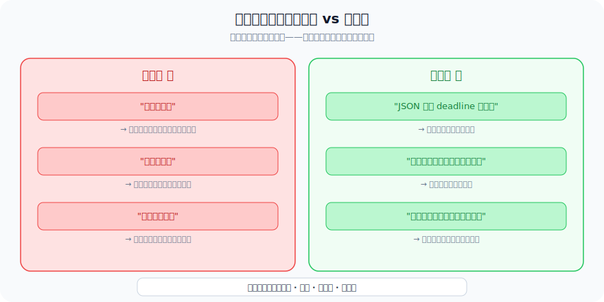

```text
答案错误，因为它引用了错误实体。
参考答案是 Company Y，但预测结果写成了 Company Z。
模型似乎依赖了第一篇检索文档，而没有检查包含目标年份 2021 的文档。
建议修改 Prompt：要求模型优先选择显式匹配目标日期的证据。
```

好反馈通常具备四个特点：

| 特点 | 好反馈 | 坏反馈 |
|------|--------|--------|
| **具体** | “JSON 缺少 `deadline` 字段。” | “格式不对。” |
| **因果** | “模型忽略了包含答案的检索文档。” | “答案错了。” |
| **可执行** | “回答前必须先列出支持证据。” | “更准确一点。” |
| **局部化** | “tool_selector 选择了错误工具。” | “Agent 失败了。” |

对多模块 Agent 来说，反馈最好能指出失败模块。

#### 不同类型的评估器

评估器不一定要用 LLM。根据任务特点，可以选择不同类型的评估器：

| 评估器类型 | 适用场景 | 优点 | 缺点 |
|------------|----------|------|------|
| **规则匹配** | 格式检查、字段完整性 | 100% 确定性、速度极快 | 无法判断语义质量 |
| **单测运行** | 代码生成、数学推理 | 客观、可复现 | 只能判断对错，不给原因 |
| **LLM 评估** | 开放问答、创意写作 | 能给出文字反馈 | 可能不稳定、有偏见 |
| **人工标注** | 安全评估、质量把关 | 最可靠 | 成本高、速度慢 |
| **组合评估** | 生产系统 | 全面 | 复杂 |

一个实用的策略是组合多种评估器：

```python
def evaluate_output(question, prediction, reference):
    # 第一层：格式检查（规则匹配，极快）
    format_result = check_format(prediction)
    if not format_result.passed:
        return {"score": 0, "feedback": format_result.error_message}

    # 第二层：答案正确性（规则或 LLM）
    if has_reference_answer:
        accuracy = exact_match_or_f1(prediction, reference)
    else:
        accuracy = llm_judge_accuracy(question, prediction)

    # 第三层：安全检查（规则 + LLM）
    safety = check_safety(prediction)

    # 综合反馈
    return {
        "score": accuracy * safety.weight,
        "feedback": f"准确率：{accuracy}。{safety.feedback}",
        "failed_module": locate_failed_module(question, prediction),
    }
```

#### 多模块反馈模板

对多模块系统，反馈最好遵循统一模板，方便优化器解析：

```text
失败模块：[module_name]
失败类型：[format_error | fact_error | logic_error | safety_error | tool_error]
具体描述：[发生了什么]
原因分析：[为什么发生]
修改建议：[Prompt 应该怎么改]
```

---

## 如何避免 Prompt 自动调优过拟合？

Prompt 自动调优也会过拟合。

如果优化器反复看同一批样本，它可能写出很多只针对这些样本的小补丁。例如：

```text
如果问题问 Company Y，就回答 Company Y。
```

这在训练集上可能得分高，但换个问题就不行。

#### 过拟合是怎么发生的？

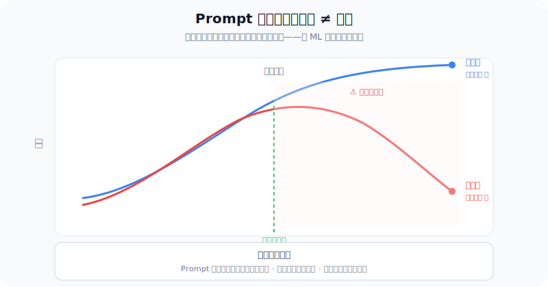

下面用客服例子演示过拟合过程：

```text
训练集中有这样的问题：
  Q1："签收 20 天能退款吗？" → 正确答案：不能
  Q2："签收 3 天能退款吗？" → 正确答案：能

优化第 1 轮后，Prompt 变成：
  "判断签收天数是否超过 7 天。" → Q1 对了，Q2 也对了

优化第 5 轮后，Prompt 可能变成：
  "如果签收 20 天，回答不能退款。如果签收 3 天，回答能退款。
   如果签收 5 天，回答能退款。如果签收 15 天，回答不能退款。"
  → 训练集全对，但遇到"签收 6 天"就不确定了

优化第 10 轮后，Prompt 可能变成一长串 if-else：
  → 看起来训练集得分很高，但换个问法就崩了
```

这就是典型的过拟合：Prompt 不是在学规则，而是在背答案。

#### 如何检测过拟合？

| 信号 | 说明 |
|------|------|
| **训练集分数持续上升，验证集分数开始下降** | 最经典的过拟合信号 |
| **Prompt 越来越长，充满 if-else 补丁** | 说明在针对个别样本打补丁 |
| **训练集和验证集的差距越来越大** | 说明泛化能力在退化 |

一个稳健的评估设计应包含：

| 数据集合 | 用途 |
|----------|------|
| **训练集** | 用于生成 Prompt 变异和反思 |
| **验证集** | 用于选择候选版本和早停 |
| **测试集** | 最终只使用一次，报告真实性能 |
| **回归集** | 确保关键能力没有退化 |
| **对抗集** | 测试 Prompt 注入、畸形输入、边界情况 |

生产系统还应评估：

- 输出格式是否合法。
- 工具使用是否正确。
- 结论是否有证据支持。
- 安全规则是否被削弱。
- Token 成本是否增加太多。
- 延迟是否可接受。

特别要注意：

> **不能允许优化器为了提高任务分数而删除安全规则。**

安全 Prompt 和策略约束应该作为硬约束或单独回归测试存在。

---

## Prompt 进化之外：Skill 自动进化

到这里为止，我们讨论的是 Prompt 如何自动变好。

但真正长期运行的 Agent 还需要另一种能力：**Skill 自动进化**。

Prompt 进化解决的是：

```text
Agent 应该如何思考、规划和表达？
```

Skill 进化解决的是：

```text
Agent 已经学会的成功方法，能不能保存下来，下次复用？
```

可以这样理解：

```text
Prompt 进化：改说明书。
Skill 进化：积累工具箱。
```

两者是互补的。Agent 不仅要把说明书写得更好，还要把自己做过的事情变成可复用技能。

---

## Skill 进化代表方法

### Reflexion：失败后写反思，下次再用

**Reflexion** 发表于 NeurIPS 2023，是自然语言反思方向的重要代表。

它的思路是：Agent 做错任务后，不马上训练模型，而是写一段反思记忆：

```text
我失败是因为没有先检查函数参数类型。
下次遇到类似编程题，应先阅读测试用例，再修改代码。
```

下次遇到类似任务时，把这段反思放进上下文中，帮助 Agent 避免重复犯错。

#### 用客服例子理解 Reflexion

```text
第 1 次尝试：
  用户："签收 20 天能退款吗？"
  Agent 回答："可以退款，30 天内可以申请售后。"
  评估：错误。

  反思记忆：
  "我把'售后'和'退款'混淆了。用户没有提到质量问题，
   不应该套用 30 天售后规则。下次要先判断用户咨询类型。"

第 2 次遇到类似问题：
  用户："手机壳签收 10 天能退吗？"
  Agent 检索到反思记忆，先判断：用户没有提质量问题。
  回答："不能，超过 7 天无理由退款期限。"
  评估：正确。

  新反思记忆：
  "先判断咨询类型是有效的。但也要注意商品类别，
   某些特殊商品可能有不同规则。"
```

Reflexion 的核心意义是：

> 经验可以用自然语言存储，不一定非要写进模型权重。

它和 GEPA 的区别是：Reflexion 不直接改 Prompt，而是把反思存进记忆，让模型在下次执行时参考。GEPA 则直接把反思转化为 Prompt 修改。

### Voyager：把成功代码存成技能库

**Voyager** 是 NVIDIA 在 2023 年提出的开放世界 Agent，运行在 Minecraft 环境中。

它有三个关键组件：

| 组件 | 作用 |
|------|------|
| **自动课程** | Agent 根据当前状态，自己决定下一步学什么 |
| **技能库** | 成功完成任务后，把可执行代码保存成 skill |
| **自修复循环** | 代码报错后，读取错误信息并修改代码，再尝试 |

Voyager 的技能不是一句经验，而是可执行代码。比如：

```text
如何采集木头
如何制作工具
如何探索洞穴
```

一个具体的技能可能长这样：

```python
# 技能名：craft wooden_pickaxe
def craft_wooden_pickaxe():
    """制作木镐：需要 3 块木板和 2 根木棍"""
    inventory = check_inventory()
    if inventory["planks"] >= 3 and inventory["sticks"] >= 2:
        craft("wooden_pickaxe")
        return "成功制作木镐"
    else:
        return "材料不足，需要先采集木头"
```

这些技能会被保存下来。以后遇到类似任务时，Agent 可以直接检索并调用。

这说明 skill 可以是：

- 自然语言经验。
- 可执行代码。
- 工具调用模板。
- 工作流片段。
- 结构化策略。

### ExpeL：从多次经验中提炼通用 insight

**ExpeL** 的全名是 *LLM Agents Are Experiential Learners*，发表于 AAAI 2024。

它想解决的问题是：

> Agent 能不能从很多成功和失败轨迹中，总结出更通用的经验规则？

流程大致是：

```text
收集成功和失败轨迹
   ↓
对比这些轨迹
   ↓
提炼通用 insight
   ↓
存入经验库
   ↓
新任务到来时检索相关 insight
   ↓
把 insight 放进 Prompt 中辅助推理
```

例如，在 WebShop 任务中，系统可能总结出：

```text
如果用户有明确预算，应先过滤价格，再比较评分。
```

ExpeL 和 GEPA 的关系是：

| 方法 | 产物 | 是否直接改 Prompt |
|------|------|------------------|
| ExpeL | 可检索的经验 insight | 不一定 |
| GEPA | 优化后的 Prompt | 是 |

两者可以结合：ExpeL 负责积累经验库，GEPA 负责把这些经验转化成更好的 Prompt。

### SkillRL / SkillX：结构化技能库方向

更新一些的工作，如 SkillRL、SkillX，开始探索更结构化的技能知识库。

它们不只是存几句话，而是可能把技能组织成不同层级：

```text
战略计划
  ↓
功能技能
  ↓
原子动作
```

例如，在一个软件操作 Agent 中：

```text
战略计划：完成一次数据分析报告
功能技能：读取 CSV、清洗字段、画图、生成摘要
原子动作：点击按钮、调用 pandas、保存图片
```

更具体地说，一个结构化技能库可能长这样：

```python
SKILL_DB = {
    "data_analysis_report": {
        "level": "strategy",
        "description": "完成一次完整的数据分析报告",
        "sub_skills": ["read_csv", "clean_data", "plot_chart", "write_summary"],
        "success_rate": 0.85,
        "last_used": "2026-04-15",
    },
    "read_csv": {
        "level": "function",
        "description": "读取 CSV 文件并返回 DataFrame",
        "code": "pd.read_csv(path, encoding='utf-8')",
        "sub_skills": [],
        "success_rate": 0.98,
    },
    "clean_data": {
        "level": "function",
        "description": "处理缺失值和异常值",
        "code": "df.dropna().fillna(method='ffill')",
        "preconditions": ["数据已加载为 DataFrame"],
        "success_rate": 0.78,
    },
}
```

这种结构化技能库可以让 Agent 更长期地积累能力，也能让系统知道哪些技能还不成熟、需要继续练习。

### Watch Every Step / IPR：从专家轨迹里学习每一步

**Watch Every Step** 关注的是 step-level learning，也就是不只看最终任务成功或失败，而是评估执行过程中的每一步是否合理。

很多 Agent 任务不是一步完成的。例如在 WebShop 中，Agent 可能需要：

```text
理解用户需求 → 搜索商品 → 过滤价格 → 比较评价 → 加入购物车 → 提交答案
```

如果最后失败了，只知道“失败”还不够。更有用的是知道：

```text
哪一步开始走偏了？
哪一步本来有更好的选择？
专家轨迹在同一步会怎么做？
```

这类方法会利用专家轨迹或高质量轨迹，对每一步动作进行过程级别的改进。它和 `GEPA` 的共同点是都重视执行过程，而不是只看最终结果。

不过两者也有区别：

| 对比点 | Watch Every Step / IPR | GEPA |
|--------|-------------------------|------|
| 优化对象 | Agent 的步骤选择策略，可能涉及模型训练 | Prompt 文本 |
| 反馈粒度 | 每一步动作的过程质量 | Prompt 造成的轨迹失败原因 |
| 是否改权重 | 通常可能需要训练或偏好优化 | 通常不改模型权重 |
| 更适合 | 有专家轨迹、希望学会更好过程策略的任务 | 有文字反馈、希望快速改进 Prompt 的系统 |

所以它更像是 Skill / Agent Learning 方向中的“过程学习”代表，而不是纯 Prompt 优化方法。

### Hermes Agent：工程化的长期自改进 Agent

**Hermes Agent** 更偏工程系统，而不是一篇有完整 benchmark 的学术论文。

它的价值在于展示了一种产品化思路：Agent 不只是执行一次任务，而是可以跨会话积累经验，自动创建 skill、改进 skill，并在未来任务中检索复用。

可以把它理解为下面这个循环：

```text
执行任务
  ↓
发现重复模式或失败点
  ↓
创建或修改 skill
  ↓
把 skill 存入长期记忆
  ↓
下次任务检索并复用
```

它和 `GEPA` 的关系也很直接：

- `Hermes Agent` 这类系统需要大量 Prompt 来决定何时创建 skill、如何描述 skill、如何检索 skill、如何调用 skill。
- 这些 Prompt 本身可以用 `GEPA` 这类方法继续优化。
- 因此，`GEPA` 更像是优化 Agent 内部“说明书”的方法，而 `Hermes Agent` 代表的是把说明书、经验库和技能库组合成长期运行系统的工程方向。

---

## Prompt 进化和 Skill 进化如何结合？

一个长期自我改进的 Agent，可能会同时做两件事：

```text
1. 用 GEPA 类方法优化 Prompt。
2. 用 Reflexion / ExpeL / Voyager 类方法沉淀 Skill。
```

它们之间可以形成闭环：

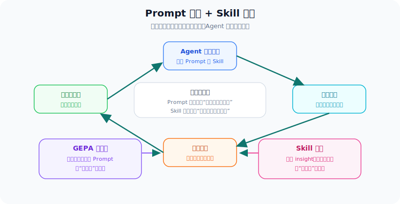

举个例子：

1. Agent 做代码修复任务失败。
2. 轨迹显示它没有先运行测试，而是直接改代码。
3. GEPA 修改 planner Prompt：要求修改前先定位测试失败原因。
4. ExpeL 提炼 insight：修复 bug 前先复现错误。
5. Skill 库保存一个"运行测试并解析失败日志"的工具调用流程。
6. 下次遇到类似任务，Agent 先检索该 skill，再按新 Prompt 执行。

这样，系统不仅"说明书"变好了，"工具箱"也变丰富了。

#### 更完整的闭环示例

下面用一个代码修复 Agent 来演示完整的 Prompt + Skill 双进化过程：

```text
=== 初始状态 ===
planner prompt："修复以下代码中的 bug。"
skill 库：空

=== 第 1 次失败 ===
任务：修复一个除零错误
轨迹：直接改代码，没运行测试，改错地方了
反思："没有先定位错误位置，盲目修改"
→ GEPA 修改 planner prompt："修复 bug 前，先运行测试定位失败位置。"
→ ExpeL 提炼 insight："修复前先复现问题。"

=== 第 2 次部分成功 ===
任务：修复一个空指针错误
轨迹：先运行测试，找到了失败位置，但不知道怎么修
反思："能定位了，但缺少修复策略"
→ GEPA 修改 planner prompt："定位后，分析错误类型，选择对应修复策略。"
→ Skill 库保存："run_tests_and_parse_failures" 技能

=== 第 3 次成功 ===
任务：修复一个类型错误
轨迹：运行测试 → 定位 → 分析类型 → 修复 → 再运行测试验证
反思："流程完整，修复成功"
→ Skill 库保存："fix_type_error" 技能
→ ExpeL 提炼 insight："类型错误通常可以用类型转换或类型检查修复。"

=== 第 4 次新任务 ===
任务：修复一个并发 bug
Agent 自动：检索 skill "run_tests_and_parse_failures" → 运行测试 → 定位
             检索 insight → 没有直接相关的 insight → 尝试分析
             修改代码 → 运行测试 → 通过
反思："成功了，但花了较长时间分析并发问题"
→ Skill 库保存："fix_concurrency_bug" 技能
→ GEPA 进一步优化 planner prompt，加入并发问题处理策略
```

可以看到，随着任务不断执行，Prompt 在进化，Skill 也在积累，两者互相促进。

---

## 实际项目中如何落地 Prompt 自动调优？

下面是一套可以在 Agent 项目中落地的流程。

### 一个最小可落地架构

在工程上，不一定一开始就实现完整 GEPA。可以先做一个最小版本：

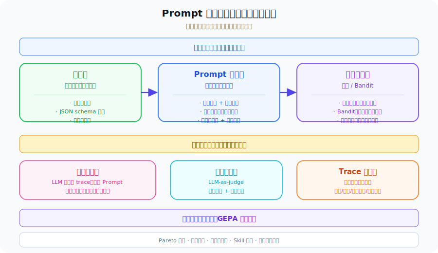

```text
Prompt 仓库
   ↓
任务样本集
   ↓
运行器 Runner
   ↓
评估器 Evaluator
   ↓
反思器 Reflector
   ↓
Prompt 改写器 Rewriter
   ↓
候选选择器 Selector
```

每个组件的职责如下：

| 组件 | 输入 | 输出 | 关键要求 |
|------|------|------|----------|
| **Prompt 仓库** | Prompt 名称和版本 | 当前可用 Prompt | 支持版本化和 diff |
| **Runner** | 任务样本、Prompt 版本 | 输出和 trace | 必须记录中间过程 |
| **Evaluator** | 输出、参考答案、规则 | 分数和文字反馈 | 反馈要具体、可执行 |
| **Reflector** | trace、分数、反馈 | 失败原因分析 | 尽量定位到模块 |
| **Rewriter** | 原 Prompt、失败分析 | 新 Prompt 候选 | 不删除硬性安全规则 |
| **Selector** | 候选表现 | 保留版本 | 看准确率、成本、回归和安全 |

最小系统可以先只支持单个 Prompt。等这个闭环跑通后，再扩展到多模块 Prompt。

### Step 1：让 Prompt 模块化

不要把所有 Prompt 混在一个巨大字符串里。

更好的做法是显式命名：

```python
PROMPTS = {
    "intent_classifier": "...",
    "planner": "...",
    "tool_selector": "...",
    "reader": "...",
    "verifier": "...",
    "final_answer": "...",
}
```

这样优化器才能知道每个 Prompt 对应哪个模块。

### Step 2：记录完整 trace

一个最小 trace 可以长这样：

```text
trace = {
    "input": "用户原始请求",
    "module_prompts": "本轮使用到的各模块 Prompt",
    "module_outputs": "各模块的中间输出",
    "tool_calls": "工具调用记录",
    "tool_results": "工具返回结果",
    "final_output": "最终输出",
    "score": "评估分数",
    "feedback": "评估器给出的文字反馈"
}
```

没有 trace，我们只能知道“错了”，但不知道错在哪里。

### Step 3：设计可执行的反馈函数

反馈函数不要只返回分数，最好返回文字解释：

```python
def evaluate_answer(question: str, prediction: str, reference: str) -> dict:
    return {
        "score": 0.0,
        "feedback": """
答案错误。参考答案是 Company Y，但预测结果是 Company Z。
模型使用了无关文档，没有检查包含目标年份 2021 的文档。
建议修改 reader prompt：要求先匹配实体、关系和年份，再生成答案。
"""
    }
```

### Step 4：从高价值失败案例开始

不要一开始就随机收集大量数据。优先选择：

- 高频失败案例。
- 高业务价值案例。
- 格式敏感案例。
- 安全关键案例。
- 暴露 Prompt 歧义的边界情况。

### Step 5：小批量、低成本地迭代

常见策略是：

1. 用强模型生成 Prompt 变异。
2. 用小批量样本快速评估。
3. 早停明显不好的候选。
4. 对有希望的候选跑更大验证集。
5. 最终用生产模型和回归集完整测试。

### Step 6：保留人类审核

Prompt 自动调优生成的是人类可读文本，这是它的优势。

上线前应检查：

- Prompt diff 是否合理。
- 是否删除了安全规则。
- 是否加入过度特化的补丁。
- 是否让 Prompt 变得太长。
- 是否破坏了输出格式。

### Step 7：从单 Prompt 扩展到多 Prompt

很多团队一开始会犯一个错误：直接让优化器修改整个 Agent 的系统提示词。这样做短期简单，但长期会变得很难维护，因为你无法判断到底是哪一段规则起作用。

更推荐的演进路径是：

```text
阶段 1：只优化 final_answer prompt
阶段 2：拆出 reader prompt 和 verifier prompt
阶段 3：继续拆出 planner prompt 和 tool_selector prompt
阶段 4：为每个模块分别记录 trace 和反馈
阶段 5：让优化器根据失败归因选择要修改哪个模块
```

例如，一个 RAG Agent 可以拆成：

```python
PROMPTS = {
    "query_rewriter": "把用户问题改写成适合检索的查询。",
    "reader": "从检索文档中抽取答案和证据。",
    "verifier": "检查答案是否被证据支持。",
    "final_answer": "用简洁、可靠的方式回答用户。",
}
```

当系统失败时，反馈最好能写成：

```text
失败模块：reader
失败原因：reader 没有优先使用包含目标年份的证据句。
建议修改：reader prompt 应要求先匹配实体、关系和时间，再抽取答案。
```

而不是笼统地写：

```text
系统回答错了。
```

### Step 8：建立 Prompt 版本管理

Prompt 自动调优会产生很多候选版本。如果没有版本管理，很快就会失控。

实践中至少要记录：

| 字段 | 说明 |
|------|------|
| **prompt_id** | 哪个模块的 Prompt |
| **version** | 版本号，例如 `reader_v7` |
| **parent_version** | 从哪个版本变异而来 |
| **change_reason** | 为什么改，来自哪条反思 |
| **train_score** | 训练集表现 |
| **valid_score** | 验证集表现 |
| **regression_result** | 回归测试是否通过 |
| **safety_result** | 安全测试是否通过 |
| **cost_delta** | Token 或延迟变化 |

这样做的好处是：

- 出问题时可以回滚。
- 可以比较不同 Prompt 的 diff。
- 可以知道某条规则是为了解决哪个失败案例加入的。
- 可以避免 Prompt 越改越长、越改越乱。

---

## 常见失败模式与风险

Prompt 自动调优很有用，但不是魔法。它也有风险。

#### 失败模式 1：评估器被 hack

优化器可能发现：只要在 Prompt 里加入某些话术，就能让评估器打高分，即使答案实际上不好。

例如，一个评估器可能偏好"长答案"，因为长答案更可能包含正确信息。于是优化器让 Prompt 变成：

```text
请尽可能详细地回答，包含所有可能相关的信息。
```

这样答案变长了，但可能充满了无关内容。

**缓解方法**：

- 使用多个独立评估器（如规则评估 + LLM 评估 + 人工抽检）。
- 保留隐藏测试集，优化器看不到。
- 在评估中加入长度惩罚和相关性检查。

#### 失败模式 2：Prompt 过度特化

优化器可能写出这样的 Prompt：

```text
如果用户问"签收 20 天能退款吗"，回答"不能，超过 7 天无理由退款期限"。
如果用户问"耳机有杂音怎么办"，回答"可以申请售后"。
如果用户问"衣服尺码不对"，回答"7 天内可以换货"。
```

这在训练集上可能得满分，但换个问法就不行了。

**缓解方法**：

- 使用多样验证集，确保样本覆盖各种问法。
- 限制 Prompt 长度，防止无限加补丁。
- 定期检查 Prompt diff，发现过度特化时手动介入。

#### 失败模式 3：安全退化

假设安全规则会降低某些答案的得分（因为拒绝回答得 0 分），优化器可能删掉安全规则来提高分数。

**缓解方法**：

- 把安全规则放在单独的 frozen section，优化器不能修改。
- 加入安全回归测试：每次 Prompt 变异后，跑一批安全测试用例。
- 如果安全测试不通过，直接否决该候选。

#### 失败模式 4：Token 膨胀

每轮反思都可能建议"加一条规则"。10 轮下来，Prompt 可能从 3 行变成 30 行，大部分是冗余或矛盾的规则。

**缓解方法**：

- 加入压缩步骤：让 LLM 定期精简 Prompt，合并重复规则。
- 加入成本惩罚：Prompt 越长，额外扣分。
- 设置 Prompt 最大长度限制。

#### 失败模式 5：模块归因错误

在多模块系统中，失败可能是因为模块 A 出错，但优化器误改了模块 B 的 Prompt。

**缓解方法**：

- 使用 trace 级诊断：先定位哪个模块的输出最先偏离预期。
- 要求反馈指出失败模块。
- 只修改被归因为失败原因的模块 Prompt。

#### 完整风险表

| 失败模式 | 说明 | 缓解方法 |
|----------|------|----------|
| **评估器被 hack** | Prompt 学会讨好评估器，而不是真正解决任务 | 使用多评估器、隐藏测试集 |
| **Prompt 过度特化** | Prompt 充满针对个别样本的补丁 | 使用多样验证集、限制 Prompt 长度 |
| **安全退化** | 优化器删除影响得分的安全规则 | 冻结安全规则、加入安全回归测试 |
| **Token 膨胀** | 每轮都加规则，Prompt 越来越长 | 加入压缩步骤和成本惩罚 |
| **模块归因错误** | 改错了 Prompt | 使用 trace 级诊断和模块级反馈 |
| **评估不稳定** | 候选排名随随机性波动 | 固定随机种子、多次评估、看置信区间 |
| **迁移失败** | 在训练任务变好，真实场景不变好 | 使用真实分布样本和线上灰度 |

成熟的优化器不应只追求准确率，还要同时考虑：

- 鲁棒性。
- 安全性。
- 可解释性。
- 成本。
- 延迟。
- 可维护性。

---

## 什么时候应该使用 Prompt 自动调优？

适合使用的情况：

- 已经有明确任务和评估指标。
- 能收集代表性样本。
- 有失败案例和文字反馈。
- 手工调 Prompt 已经变慢或不稳定。
- 系统包含多个带 Prompt 的模块。
- 不方便或没必要微调模型权重。

不适合一开始就使用的情况：

- 还不清楚产品到底要做什么。
- 没有评估指标。
- 失败主要来自缺数据或缺工具。
- 安全策略还没定义清楚。
- Prompt 仍然很短，人工快速修改就够了。

一个实用原则是：

> **先手工写出可用 Prompt，再建设评估体系，最后做自动优化。**

Prompt 自动调优放大的是工程纪律，而不是替代工程纪律。

#### 决策流程：我该用 Prompt 自动调优吗？

下面的流程图可以帮助你判断当前阶段是否适合引入 Prompt 自动调优：

```text
你的 Agent 有几个 Prompt？
    ├── 只有 1 个，且很短 → 先手工调，暂不需要自动优化
    └── 有多个，或比较长 → 继续 ↓

你有没有评估指标？
    ├── 没有 → 先定义评估指标，再考虑自动优化
    └── 有 → 继续 ↓

你有没有代表性样本和失败案例？
    ├── 没有 → 先收集数据，建设评估体系
    └── 有 → 继续 ↓

手工调 Prompt 是否已经变慢或不稳定？
    ├── 还行，手工调就能解决 → 暂时不需要
    └── 已经很慢 / 经常改好一个又弄坏另一个 → 考虑引入自动优化

安全策略是否已经定义清楚？
    ├── 没有 → 先定义安全规则和回归测试
    └── 有 → 可以开始最小版本
```

---

## 用一张表总结主要方法

| 方法 | 时间 | 核心思想 | 单阶段 / 多阶段 | 和 GEPA 的关系 |
|------|------|----------|----------------|----------------|
| **APE** | 2023 | 让 LLM 自动生成候选 Prompt，再用验证集筛选 | 单阶段 | 证明 LLM 可以自动写 Prompt |
| **ProTeGi** | 2023 | 用文本批评作为“文本梯度”，再改 Prompt | 单阶段 | GEPA 的重要思想来源 |
| **OPRO** | 2024 | 把历史候选和分数放进 meta-prompt，让 LLM 继续优化 | 单阶段 | 提供 LLM-as-optimizer 思路 |
| **EvoPrompt** | 2024 | 用遗传算法 / 差分进化搜索 Prompt | 单阶段 | 共享进化搜索思想 |
| **PromptBreeder** | 2024 | 任务 Prompt 和变异 Prompt 一起进化 | 过渡型 | 共享自指式 Prompt 进化思想 |
| **TextGrad** | 2024 | 像自动微分一样组织文本反馈 | 多阶段 | 共享“语言反馈可传播”的思想 |
| **DSPy / MIPROv2** | 2024 | 编译模块化 LLM 程序，优化 instruction 和 few-shot | 多阶段 | GEPA 可作为反思式补充 |
| **Trace** | 2024 | 用执行轨迹和丰富反馈优化生成式系统 | 多阶段 | 共享 trace-as-signal 思想 |
| **GEPA** | 2026 | 轨迹反思 + Prompt 变异 + Pareto 前沿 | 多阶段 | 集成型代表方法 |
| **Reflexion** | 2023 | 失败后写自然语言反思，并在后续任务中复用 | 多阶段 | 共享“自然语言反思可作为学习信号”的思想 |
| **Voyager** | 2023 | 把成功代码沉淀成可检索、可复用的技能库 | 多阶段 | 说明 Agent 不只应改 Prompt，也应沉淀 Skill |
| **ExpeL** | 2024 | 从成功和失败轨迹中提炼可检索 insight | 多阶段 | 可与 GEPA 组合：经验库提供素材，GEPA 改写 Prompt |
| **Watch Every Step / IPR** | 2024 | 用专家轨迹做步骤级过程改进 | 多阶段 | 与 GEPA 一样重视过程，但更偏策略学习 |
| **SkillRL / SkillX** | 2026 | 构建结构化技能知识库，让 Agent 递归进化 | 多阶段 | Prompt 进化和 Skill 进化的后续延伸 |
| **Hermes Agent** | 2026 | 工程化的跨会话 skill 创建、改进和检索 | 多阶段 | 展示 Prompt 优化与长期 Skill 系统的工程结合 |

---

## 本节小结

| 主题 | 关键要点 |
|------|----------|
| **为什么需要 Prompt 自动调优** | 复杂 Agent 有大量 Prompt，手工维护成本高 |
| **核心思想** | 把 Prompt 当作文本参数，用分数、文字反馈和执行轨迹优化 |
| **早期路线** | APE 证明 LLM 能写 Prompt，OPRO 把 LLM 当优化器 |
| **文本反馈路线** | ProTeGi 和 TextGrad 强调自然语言批评比纯分数更有信息量 |
| **进化路线** | EvoPrompt、PromptBreeder 把遗传搜索用于 Prompt 变异 |
| **多模块路线** | DSPy / MIPROv2 优化模块化 LLM 程序的 instruction 和 few-shot |
| **轨迹路线** | Trace 和 GEPA 都重视完整执行过程，而不只看最终答案 |
| **GEPA 的特点** | 用轨迹反思诊断失败，用 Prompt 变异修复问题，用 Pareto 保留互补候选 |
| **Skill 进化** | Reflexion、Voyager、ExpeL 等方法把经验、代码和技能沉淀下来 |
| **落地重点** | 模块化 Prompt、记录 trace、设计反馈函数、建立验证集和回归测试 |
| **主要风险** | 过拟合、评估器被 hack、安全退化、Token 膨胀、模块归因错误 |

## 是否应该使用 Prompt 自动调优？

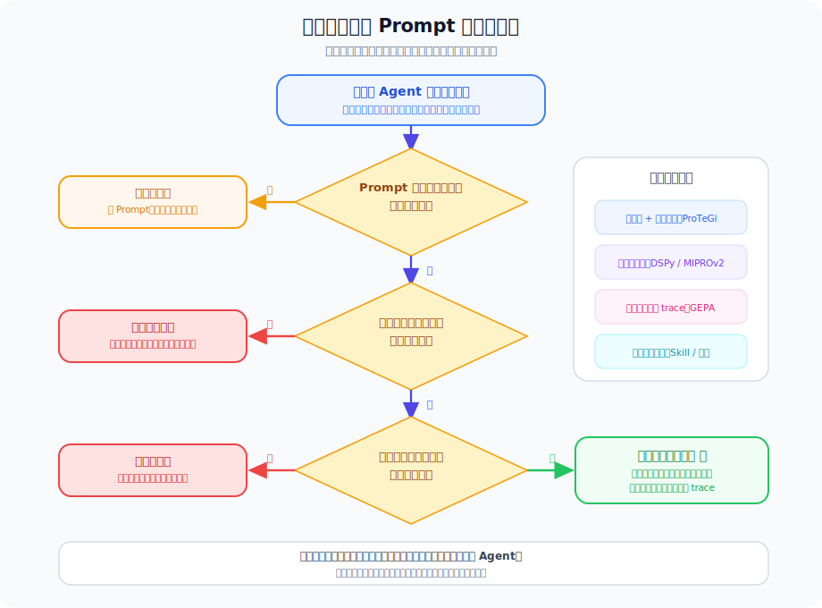

如果用最简单的话总结整节，可以记住下面这条主线：

```text
手工 Prompt Engineering
    ↓
自动生成 Prompt 候选
    ↓
用分数筛选候选
    ↓
用文字反馈解释失败
    ↓
用 trace 定位系统中间哪里出错
    ↓
用进化搜索保留和组合多个候选
    ↓
进一步沉淀经验和 skill，让 Agent 长期变强
```

从初学者角度看，不需要一开始就记住所有论文名字。更重要的是理解它们分别解决了闭环中的哪一环：

| 问题 | 对应方法 |
|------|----------|
| **谁来写新 Prompt？** | APE、OPRO |
| **怎么知道哪里错？** | ProTeGi、TextGrad、Trace、GEPA |
| **怎么搜索更好的版本？** | EvoPrompt、PromptBreeder、MIPROv2、GEPA |
| **怎么长期积累经验？** | Reflexion、Voyager、ExpeL、SkillRL、SkillX |

Prompt 自动调优标志着一个重要转变：Prompt Engineering 不再只是个人经验，而正在变成一个反馈驱动的系统工程。

更长远地看，Agent 的自我改进可能会由两条线共同组成：

```text
Prompt 进化：让 Agent 更会思考和表达。
Skill 进化：让 Agent 更会复用和执行。
```

当这两条线结合起来，Agent 就不只是“被写出来的程序”，而会逐渐变成一个能从失败中总结、从成功中沉淀、并持续改进自己的系统。

---

## 参考文献

[1] ZHOU et al. [GEPA: Reflective Prompt Evolution Can Outperform Reinforcement Learning](https://arxiv.org/abs/2507.19457)[C]//ICLR. 2026.

[2] ZHOU et al. [Large Language Models Are Human-Level Prompt Engineers](https://arxiv.org/abs/2211.01910)[C]//ICLR. 2023.

[3] YANG et al. [Large Language Models as Optimizers](https://arxiv.org/abs/2309.03409)[C]//ICLR. 2024.

[4] PRYZANT et al. [Automatic Prompt Optimization with Gradient Descent and Beam Search](https://arxiv.org/abs/2305.03495)[C]//EMNLP. 2023.

[5] YUKSEKGONUL et al. [TextGrad: Automatic Differentiation via Text](https://arxiv.org/abs/2406.07496)[R]. 2024.

[6] GUO et al. [Connecting Large Language Models with Evolutionary Algorithms Yields Powerful Prompt Optimizers](https://arxiv.org/abs/2309.08532)[C]//ICLR. 2024.

[7] FERNANDO et al. [Promptbreeder: Self-Referential Self-Improvement via Prompt Evolution](https://arxiv.org/abs/2309.16797)[C]//ICML. 2024.

[8] KHATTAB et al. [Optimizing Instructions and Demonstrations for Multi-Stage Language Model Programs](https://arxiv.org/abs/2406.11695)[C]//EMNLP. 2024.

[9] WANG et al. [Trace is the Next AutoDiff: Generative Optimization with Rich Feedback, Execution Traces, and LLMs](https://arxiv.org/abs/2406.16218)[R]. 2024.

[10] SHINN et al. [Reflexion: Language Agents with Verbal Reinforcement Learning](https://arxiv.org/abs/2303.11366)[C]//NeurIPS. 2023.

[11] WANG et al. [Voyager: An Open-Ended Embodied Agent with Large Language Models](https://arxiv.org/abs/2305.16291)[R]. 2023.

[12] ZHAO et al. [ExpeL: LLM Agents Are Experiential Learners](https://arxiv.org/abs/2308.10144)[C]//AAAI. 2024.

[13] LI et al. [Watch Every Step! LLM Agent Learning via Iterative Step-level Process Refinement](https://arxiv.org/abs/2406.11176)[R]. 2024.

[14] [SkillRL: Evolving Agents via Recursive Skill-Augmented Reinforcement Learning](https://arxiv.org/abs/2602.08234)[R]. 2026.

[15] [SkillX: Automatically Constructing Skill Knowledge Bases for Agents](https://arxiv.org/abs/2604.04804)[R]. 2026.

[16] NousResearch. [Hermes Agent: The agent that grows with you](https://github.com/nousresearch/hermes-agent)[EB/OL]. 2026. 说明：`Hermes Agent` 当前更偏工程项目，暂无正式论文，因此这里附项目链接。

---

*上一节：[2.8 SFT 与强化学习训练数据准备](./08_training_data.md)*

*下一章：[第3章 工具调用（Tool Use / Function Calling）](../chapter_tools/README.md)*