# 第一部分：入门篇

# 大模型入门：不会编程的人，应该怎么开始使用 AI？

> 🌱 *"用好大模型的第一步，不是理解所有技术细节，而是知道它能做什么、不能做什么，以及怎样把任务说清楚。"*

本章不要求你会编程，也不要求你理解神经网络。我们只从使用者的角度出发，把大模型当成一个日常工具来理解。

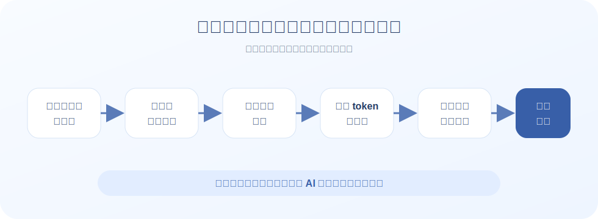

你可以先把大模型想象成一个非常擅长语言工作的助手：它能读材料、写草稿、改表达、做总结、列计划、解释概念、生成代码，也能陪你一起头脑风暴。

但它不是绝对可靠的专家，也不是天然知道事实真相的数据库。它更像一个能力很强、反应很快、但需要你检查结果的协作者。

用好大模型的第一步，不是学习复杂理论，而是学会把任务说清楚。

### 本章应该怎么读？

这一章是写给零基础读者的。你不需要记住所有模型名字，也不需要精确计算 token，更不需要理解模型内部怎么训练。

建议你只抓住四件事：

| 你要建立的直觉 | 一句话理解 |
|---|---|
| **大模型是什么** | 一个擅长处理语言的协作者 |
| **大模型能做什么** | 帮你读、写、改、总结、解释、规划 |
| **怎么问更有效** | 给背景、目标、材料、要求和输出格式 |
| **什么时候要小心** | 重要事实、数字、法律、医疗、金融建议都要验证 |

如果你读完本章之后，能开始把大模型用于自己的学习、写作、办公或编程辅助，那么这一章的目的就达到了。

## 大模型不是搜索引擎，而是语言协作者

很多人第一次用大模型时，会把它当成搜索引擎来用：

```text
世界上最高的山是哪座？
某某公司今年营收是多少？
某个新闻是真的吗？
```

这当然也能问，但这不是大模型最有价值的地方。

搜索引擎更擅长帮你**找到资料来源**；计算器更擅长完成**精确计算**；大模型真正擅长的是**处理语言和任务**。

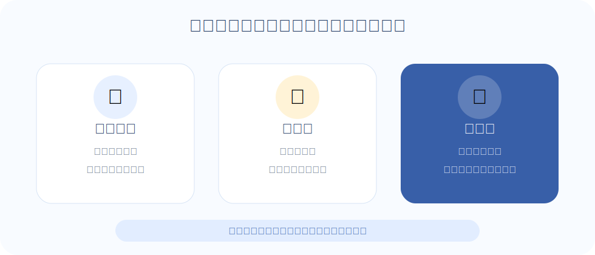

比如，同样是一篇很长的文章：

- 搜索引擎可以帮你找到它。
- 浏览器可以帮你打开它。
- 大模型可以帮你总结它、解释它、改写它、提炼它的观点，甚至帮你把它变成一份讲稿。

所以，一个更准确的理解是：

> **搜索引擎帮你找资料，大模型帮你处理资料。**

如果你只问大模型一个事实问题，它可能只是一个不稳定的问答机器；但如果你把一段材料、一项任务、一个目标交给它，它就会变成一个很有用的协作者。

## 把大模型想象成一个“能力很强但需要检查的实习生”

对零基础读者来说，最容易理解的大模型类比是：**实习生**。

这个实习生读过很多材料，写东西很快，模仿能力很强，也能帮你整理思路。但它有几个明显缺点：

- 它可能不知道你真正的背景。
- 它可能误解你的目标。
- 它可能为了给出完整答案而编造细节。
- 它可能把旧信息当成新信息。
- 它写出来的东西很像真的，但不一定真的正确。

因此，正确的使用方式不是“让它一次性给最终答案”，而是和它来回协作。

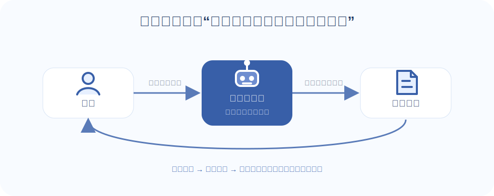

一个常见的使用闭环是：

1. 你告诉它任务和背景。
2. 它给出初稿。
3. 你检查哪里不对、哪里不够。
4. 你补充要求。
5. 它继续修改。
6. 最后由你决定能不能使用。

例如，你可以这样说：

```text
我准备写一篇给高中生看的 AI 科普文章。
请先帮我列一个大纲，不要直接写全文。
要求语言轻松，不要出现复杂公式。
每一节都给一个生活类比。
```

这比简单说“帮我写一篇 AI 文章”要好得多，因为它给了模型明确的身份、读者、任务、限制和输出目标。

## 大模型能帮普通人做什么？

大模型最基础的能力不是“像人一样思考”，而是**围绕语言做各种变换和组织**。

你给它一段话，它可以总结；你给它一个主题，它可以起草；你给它一堆想法，它可以整理；你给它一个概念，它可以解释；你给它一段代码，它可以分析。

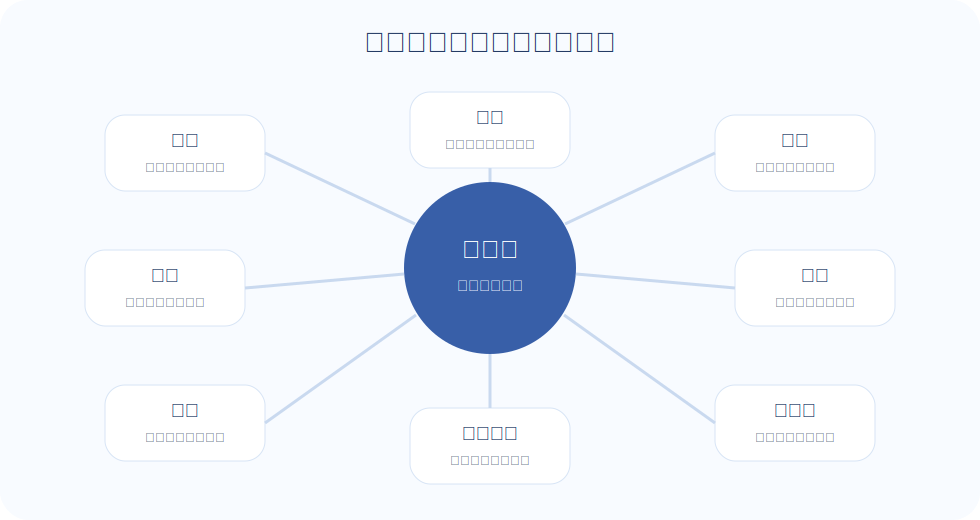

从普通人的角度，可以先把它的用途分成几类：

| 场景 | 大模型能做什么 | 你可以这样问 |
|---|---|---|
| **学习** | 解释概念、制定学习计划、出题、批改答案 | “用初中生能懂的话解释什么是通货膨胀” |
| **写作** | 起草、润色、改风格、扩写、压缩 | “把这段话改得更清楚、更适合公众号开头” |
| **办公** | 写邮件、整理会议纪要、提炼待办事项 | “把这段会议记录整理成负责人、事项、截止时间三列” |
| **阅读** | 总结长文、提炼观点、对比资料 | “总结这篇文章的核心观点，并列出作者的三个论据” |
| **编程** | 解释代码、生成脚本、排查报错 | “这段 Python 报错是什么意思？我应该怎么改？” |
| **创意** | 起名、写脚本、做方案、头脑风暴 | “给一个 AI 入门课程起 10 个标题，风格要轻松” |
| **决策辅助** | 列选项、做利弊分析、补充盲点 | “我应该买平板还是笔记本？请帮我列决策表” |
| **多模态** | 看图、读截图、解释图表 | “这张报表说明了什么问题？” |

这里有一个很重要的原则：

> **大模型最适合帮你完成初稿，而不是替你做最终判断。**

比如它可以帮你写简历初稿，但你要检查经历是否真实；它可以帮你总结合同，但重要条款仍要找专业人士确认；它可以帮你分析体检报告，但不能替代医生诊断。

## 怎么向大模型提问？

很多人觉得模型不好用，不一定是模型太差，而是问题太模糊。

比如这类问题通常效果不好：

```text
帮我写个方案。
```

模型不知道你是谁，不知道方案给谁看，不知道目标是什么，不知道篇幅多长，也不知道你喜欢什么风格。它只能猜。

对新手来说，最简单的提问公式是：

> **背景 + 目标 + 材料 + 要求 + 输出格式**

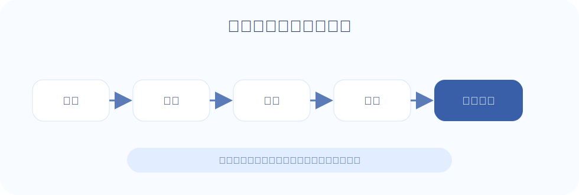

我们把刚才那个模糊问题改写一下：

```text
我是一名大学老师，准备给零基础学生上一节 90 分钟 AI 入门课。
目标是让他们知道大模型能做什么，并完成一次有效提问。
请帮我设计课程大纲。
要求：
1. 不讲公式；
2. 每 20 分钟有一个互动；
3. 最后给一个课堂练习；
4. 用表格输出。
```

这个问题就清楚得多。

它告诉了模型：

- **背景**：大学老师，面向零基础学生。
- **目标**：理解大模型能做什么，并完成一次有效提问。
- **任务**：设计课程大纲。
- **要求**：不讲公式、有互动、有练习。
- **格式**：用表格输出。

你也可以把它记成一个模板：

```text
你现在扮演【角色】。
我要完成【任务】。
背景是【背景信息】。
我已经有的材料是【材料】。
请你按照【要求】完成。
输出格式是【格式】。
如果信息不够，请先问我问题。
```

最后一句“如果信息不够，请先问我问题”非常有用。它会让模型不要急着编，而是先补齐关键信息。

## token 是什么？

使用大模型时，经常会看到一个词：**token**。

你不需要一开始就理解它的精确定义。可以先把 token 粗略理解成：**模型处理文字时使用的小颗粒**。

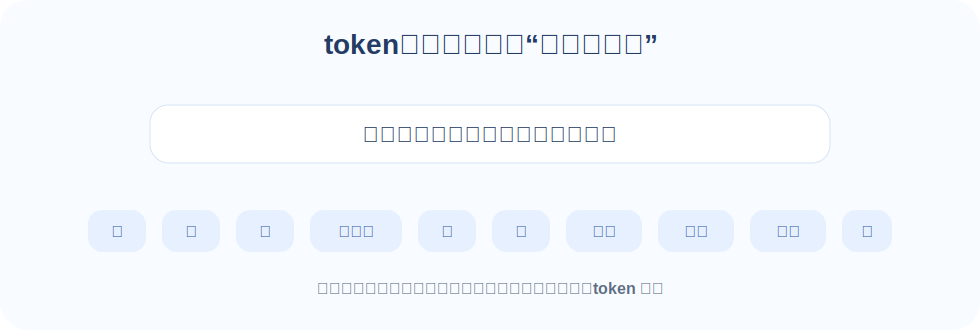

比如一句话：

```text
我想让大模型帮我总结这篇文章。
```

在模型内部，它不会像人一样完整地看这句话，而是会把文字切成一个个更小的单位。中文里，一个 token 可能接近一个字、一个词或一个标点；英文里，一个 token 可能是一个单词，也可能是单词的一部分。

普通用户不需要精确计算 token。你只要记住一句话：

> **输入越长，输出越长，消耗的 token 就越多。**

这里的“输入”不只是你刚刚打的那一句问题，还可能包括：

- 你前面多轮对话的历史。
- 你上传的文档。
- 你粘贴的代码。
- 系统给模型的规则。
- 工具调用返回的内容。

模型回答你的内容，则会变成输出 token。

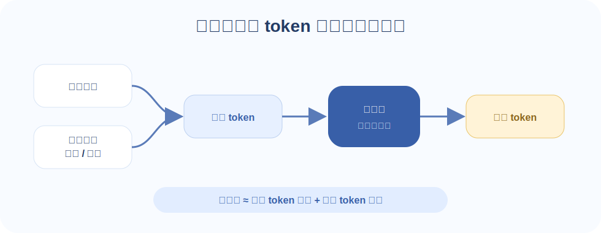

因此，一次大模型调用的成本通常可以粗略理解为：

```text
总成本 ≈ 输入 token 成本 + 输出 token 成本
```

很多模型的输出 token 会比输入 token 更贵，因为生成内容需要更多计算。

## 一次使用大模型大概要花多少钱？

如果你使用的是 ChatGPT、Claude、Gemini、Kimi、豆包、通义、DeepSeek 这类面向普通用户的产品，通常不需要自己计算每次 token 成本。你更常见的是免费额度、会员订阅、次数限制或套餐限制。

如果你是开发者，通过 API 调用模型，就需要更关注 token 成本。

到本书写作时，大模型 API 已经比早期便宜很多。普通聊天、短文本润色、简单总结这类任务，单次成本通常很低；但如果你让模型处理长文档、整个代码库，或者让 Agent 自动执行很多步，成本就会明显上升。

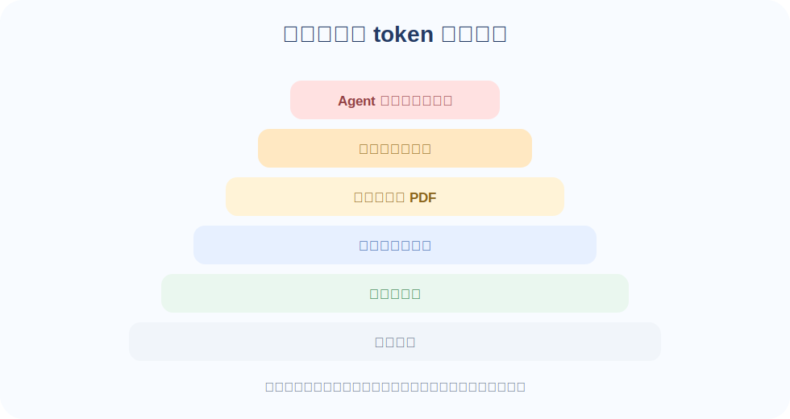

可以用下面这个表建立直觉：

| 使用场景 | token 消耗感受 | 成本提醒 |
|---|---|---|
| **问一个简单问题** | 很低 | 通常不用太担心 |
| **润色一段话** | 很低 | 适合日常高频使用 |
| **写一篇短文** | 低 | 输出越长成本越高 |
| **总结一篇长文章** | 中等 | 文章越长输入越多 |
| **分析几十页 PDF** | 较高 | 注意上下文长度和费用 |
| **分析整个代码库** | 较高 | 可能需要分批处理 |
| **Agent 自动执行几十步** | 可能很高 | 要设置预算和停止条件 |

这里要特别注意多轮对话。

很多聊天产品会把历史对话一起发给模型，这样模型才能“记得前面说过什么”。这很方便，但也意味着对话越长，输入 token 可能越多。

如果你发现一个对话已经非常长，可以考虑开启新对话，并先让模型总结前面的关键信息，再把总结带到新对话里。

## 新手到底该用哪个 AI？怎么下载？要不要付费？

很多新手最关心的问题不是模型排行榜，而是三个很实际的问题：**我现在该用哪个？去哪里下载？要不要花钱？**

先给一个直接结论：

> **完全零基础的新手，不要一开始研究所有模型。先选一个容易打开、中文体验好、免费额度够用的聊天产品，用一周再决定要不要付费。**

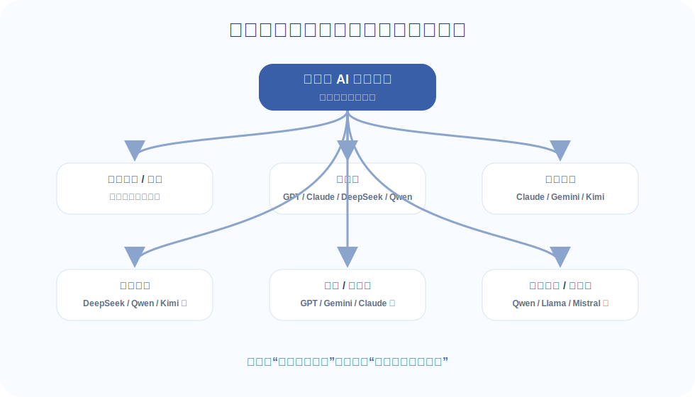

### 如果你只想马上开始，可以这样选

| 你的情况 | 推荐先用 | 为什么 |
|---|---|---|
| **只想体验 AI、写作、总结、学习** | `豆包`、`Kimi`、`通义千问`、`文心一言`、`智谱清言` | 中文体验好，注册和使用门槛低，通常有免费额度 |
| **经常读长文档、论文、报告** | `Kimi`、`Claude`、`Gemini` | 更适合长文本阅读、总结和提炼观点 |
| **想要综合能力强，能写作也能写代码** | `ChatGPT`、`Claude`、`Gemini` | 通用能力强，适合问答、写作、代码和复杂任务 |
| **主要写代码、改项目** | `Cursor`、`Trae`、`GitHub Copilot`、`Claude Code` | 能和代码编辑器或项目文件结合，不只是聊天 |
| **想低成本调用 API 或本地部署** | `DeepSeek`、`Qwen`、`Llama` | 更偏开发者场景，普通新手可以暂时不用管 |

如果你还是不知道怎么选，可以按这个顺序来：

1. **第一步**：先用一个国内聊天产品，比如 `豆包` 或 `Kimi`。
2. **第二步**：如果你能正常访问海外服务，再试 `ChatGPT`、`Claude` 或 `Gemini`。
3. **第三步**：如果你开始写代码或改项目，再考虑 `Cursor`、`Trae`、`GitHub Copilot` 这类编程工具。

对大多数零基础用户来说，**第一周只用一个工具就够了**。不要今天换这个、明天换那个，否则你很难判断到底是工具不行，还是自己的提问方式还不清楚。

### 去哪里下载或打开？

最安全的方式是：**优先用官网、官方应用商店，不要随便下载来历不明的安装包。**

| 使用方式 | 怎么开始 | 适合谁 |
|---|---|---|
| **网页端** | 在浏览器里搜索产品名称，进入官网登录使用 | 电脑用户，不想安装软件的人 |
| **手机 App** | 在 `App Store`、安卓应用商店搜索产品名称 | 日常聊天、拍照识图、碎片时间使用 |
| **桌面客户端** | 从产品官网下载，比如 `Cursor`、`Trae` | 需要读写代码项目、长时间办公的人 |
| **编辑器插件** | 在 `VS Code`、`JetBrains` 等编辑器插件市场安装 | 已经在写代码的人 |

新手可以记住这几个原则：

- **能用网页端就先用网页端**：不用安装，风险最低。
- **手机端适合日常使用**：比如拍照识图、语音提问、随手总结。
- **编程工具不要太早装**：如果你还不写代码，先用聊天产品就够了。
- **看清官方来源**：下载前确认产品名称、开发者和官网，避免山寨应用。

### 常用 AI / Agent 官方入口速查

下面这张表不是排行榜，而是给新手准备的**安全入口清单**。链接和产品形态可能会变化，实际下载时仍然以官网、官方应用商店和项目 README 为准。

| 工具 / 产品 | 类型 | 官方入口 | 新手怎么用                                            |
|---|---|---|--------------------------------------------------|
| `ChatGPT` | 聊天产品 / 通用 AI 助手 | [ChatGPT](https://chatgpt.com/) / [OpenAI](https://openai.com/chatgpt/) | 适合通用问答、写作、学习、代码解释                                |
| `Claude` | 聊天产品 / 长文档与代码助手 | [Claude](https://claude.ai/) | 适合长文档阅读、严谨写作、代码理解                                |
| `Gemini` | 聊天产品 / 多模态助手 | [Gemini](https://gemini.google.com/) | 适合图片、视频、长资料和 Google 生态                           |
| `DeepSeek` | 聊天产品 / 模型 API | [DeepSeek Chat](https://chat.deepseek.com/) / [DeepSeek API 平台](https://platform.deepseek.com/) | 普通用户用聊天网页；开发者再看 API                              |
| `豆包` | 中文聊天产品 / 多模态助手 | [豆包](https://www.doubao.com/) | 适合中文日常使用、写作、搜索、图片理解                              |
| `Kimi` | 中文聊天产品 / 长文档阅读 | [Kimi](https://kimi.moonshot.cn/) | 适合上传资料、总结长文档、读论文报告                               |
| `Qwen / 通义千问` | 中文聊天产品 / 开源模型生态 | [Qwen Chat](https://chat.qwen.ai/) / [通义千问](https://tongyi.aliyun.com/qianwen/) / [Qwen GitHub](https://github.com/QwenLM) | 普通用户用聊天入口；开发者看开源模型和 API                          |
| `Cursor` | AI IDE / 编程 Agent | [Cursor](https://www.cursor.com/) | 适合在类似 VS Code 的编辑器里写代码、改项目                       |
| `Trae` | AI IDE / 编程 Agent | [Trae 国际版](https://www.trae.ai/) / [Trae 国内版](https://www.trae.com.cn/) | 适合中文开发者在 IDE 里使用 AI 编程能力                         |
| `GitHub Copilot` | 编程助手 / IDE 插件 | [GitHub Copilot](https://github.com/features/copilot) | 适合在 VS Code、JetBrains、Visual Studio 等编辑器里补全和解释代码 |
| `Claude Code` | 终端编程 Agent | [Claude Code](https://www.anthropic.com/claude-code) / [官方文档](https://docs.anthropic.com/en/docs/claude-code/overview) | 适合在终端里读项目、改文件、跑测试；新手要先从小任务开始                     |
| `Codex` | OpenAI 编程 Agent / CLI | [OpenAI Codex GitHub](https://github.com/openai/codex) / [OpenAI](https://openai.com/) | 适合开发者在终端或 ChatGPT 生态里处理代码任务                      |
| `WorkBuddy` | 桌面 Agent / 办公 Agent | [WorkBuddy](https://www.codebuddy.cn/work/) | 适合处理文件、表格、PPT、会议纪要和多步骤办公任务                       |
| `OpenClaw` | 开源本地 Agent / 自动化平台 | [OpenClaw GitHub](https://github.com/openclaw/openclaw) | 更适合愿意折腾部署的用户；新手要先看 README 和权限说明                  |
| `Hermes Agent` | 开源自学习 Agent | [Hermes Agent](https://hermes-agent.nousresearch.com/) / [GitHub](https://github.com/NousResearch/hermes-agent) | 适合想研究开源 Agent、记忆和技能学习机制的开发者                      |

如果你只是想开始用 AI，不必把这些全装一遍。更稳妥的顺序是：**先用 `豆包`、`Kimi`、`ChatGPT` 这类聊天产品；开始写代码后再用 `Cursor`、`Trae`、`Copilot`；需要 AI 真正操作文件和流程时，再考虑 `WorkBuddy`、`OpenClaw`、`Hermes Agent` 这类 Agent 工具。**

### 免费版够不够？什么时候需要付费？

新手刚开始通常**不需要马上付费**。先用免费版完成下面这些任务：

- 解释一个概念。
- 总结一篇文章。
- 润色一段文字。
- 制定一个学习计划。
- 帮你改一封邮件。
- 分析一张截图或一份短文档。

如果你连续用了一周，发现它确实能帮你省时间，再考虑付费。

| 情况 | 建议 |
|---|---|
| **只是偶尔问问题** | 免费版通常够用 |
| **每天都用来学习、写作、办公** | 可以考虑开一个月会员试试 |
| **经常上传长文档、图片、表格** | 付费版通常限制更少，体验更稳定 |
| **经常写代码、调试项目** | 可以考虑 `Cursor`、`Copilot` 或更强的聊天模型会员 |
| **只是想试试看** | 不建议一开始年付，先月付或先免费试用 |
| **要在程序里调用模型 API** | 这是开发者场景，通常按 token 或调用量计费，新手可以先跳过 |

付费时要注意两点：

1. **付费不等于答案一定正确**：重要事实、数字、法律、医疗、金融建议仍然要核验。
2. **不要同时订阅太多工具**：普通用户先固定一个主力工具就够了，等遇到明确瓶颈再换。

一个简单的选择建议是：

> **不想折腾：先用 `豆包` 或 `Kimi`。想要更强综合能力：再试 `ChatGPT`、`Claude` 或 `Gemini`。开始认真写代码：再上 `Cursor`、`WorkBuddy` 或 `GitHub Copilot`。**

最重要的是：

> **不要问“哪个模型永远最好”，而要问“我现在这个任务，用哪个最省事”。**

## 从聊天窗口到 AI 工具：普通人应该怎么选？

前面我们一直在讨论“选哪个模型”。但当你真正开始用 AI 时，很快会遇到另一个问题：

- 我应该直接用 `ChatGPT`、`Claude`、`Gemini` 这样的聊天产品，还是用专门的 AI 编程工具？
- `Claude Code`、`Codex`、`Cursor`、`Trae` 看起来都能写代码，它们有什么区别？
- `WorkBuddy`、`OpenClaw` 这类桌面 Agent 是不是更高级？
- `Harness`、`Trace` 这些工程化概念，新手现在需要关心吗？

先记住一个非常实用的判断：

> **模型是“大脑”，工具是“工作台、手脚、权限和过程记录”。**

同一个模型，放在聊天窗口里，主要是在回答你；放在编程 Agent 里，就可以读项目、改文件、运行测试；放在办公 Agent 里，可能还能整理文档、操作表格、生成 PPT；放在企业 Agent 系统里，则需要权限、日志、评测和审计来保证安全可靠。

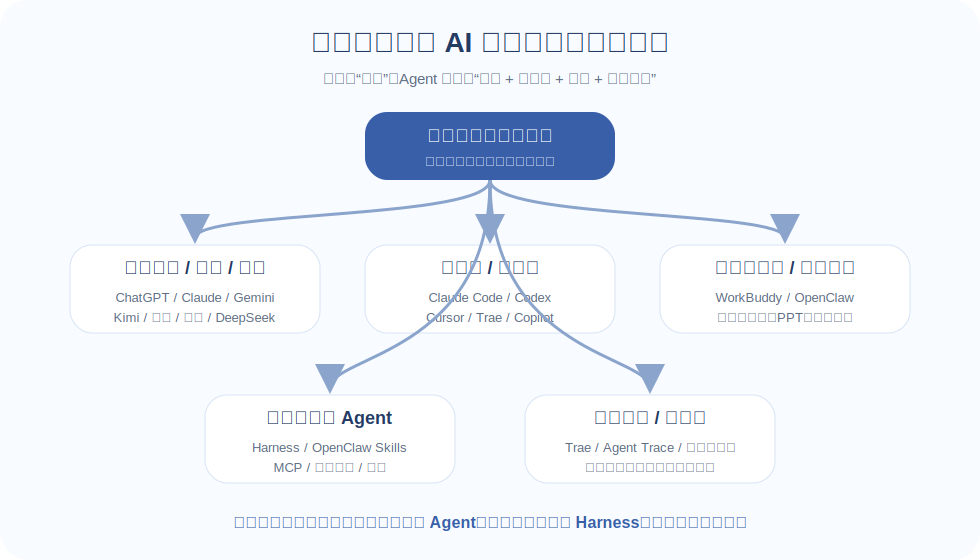

所以，新手不必一开始就研究所有工具。你只要先问自己三个问题：

| 先问自己 | 如果答案是 | 更适合选择 |
|---|---|---|
| **它需要操作我的文件或代码吗？** | 不需要，只是问答、写作、总结 | 聊天产品 |
| **它需要理解并修改一个项目吗？** | 需要读代码、改文件、跑测试 | 编程 Agent / AI IDE |
| **它需要长期执行、调用工具或处理敏感数据吗？** | 需要自动化、权限、审计、回滚 | Agent Harness / Trace / 企业工作流 |

一句话总结：

> **先用聊天产品学会提问，再用 Agent 处理真实任务，最后才考虑 Harness 和 Trace 这类工程体系。**

### 先分清：模型、聊天产品、Agent、Harness、Trace 不是一回事

这些词经常被混在一起，但它们其实处在不同层级。

| 名词 | 更像什么 | 典型例子 | 新手怎么理解 |
|---|---|---|---|
| **模型** | 大脑 | `GPT`、`Claude`、`Gemini`、`DeepSeek`、`Qwen` | 负责理解、推理和生成内容 |
| **聊天产品** | 对话窗口 | `ChatGPT`、`Claude`、`Kimi`、`豆包`、`通义` | 最适合入门，用来问答、写作、总结、解释 |
| **AI IDE / 编程 Agent** | 会改代码的 AI 同事 | `Claude Code`、`Codex`、`Cursor`、`Trae`、`Copilot` | 能读项目、编辑文件、运行命令、修 bug |
| **办公 / 桌面 Agent** | 会操作办公工具的 AI 助手 | `WorkBuddy`、`OpenClaw` | 能处理文件、表格、PPT、消息和多步骤流程 |
| **Harness** | Agent 的外壳和控制台 | 工具编排、权限、记忆、评测、日志 | 让 Agent 安全、稳定、可控地执行任务 |
| **Trace / Agent Trace** | 过程记录 | 执行日志、代码归因、审计记录 | 记录 AI 做了什么，方便检查、追责和回滚 |

可以把它们想象成一个逐层增强的系统：

```text
模型 → 聊天产品 → Agent 工具 → Harness → Trace / 审计 / 评测
```

越往右，AI 能做的事情越多，但风险和管理成本也越高。对新手来说，正确的顺序不是“直接上最强工具”，而是**先从低风险场景开始，逐步放权**。

### 1. 聊天产品：最适合新手的第一站

如果你的任务主要是读、写、改、总结、解释、规划，聊天产品通常就够用了。

常见选择包括：

- `ChatGPT`：综合能力和工具生态成熟，适合通用问答、写作和代码辅助。
- `Claude`：长文档阅读、文字表达和严谨总结通常表现很好。
- `Gemini`：多模态和长上下文能力突出，适合图片、视频、长资料和 Google 生态。
- `Kimi`：中文长文档阅读体验友好，适合资料总结、论文和报告阅读。
- `豆包`、`通义`、`文心`、`GLM`：适合中文办公、内容生成和国内应用生态。
- `DeepSeek`、`Qwen`：常被开发者用于代码、推理、低成本 API 或本地部署。

比如你可以这样问：

```text
我有一份 20 页的行业报告。
请先帮我总结成 10 条要点，再列出 3 个我应该重点关注的风险。
要求：不要编造报告里没有的信息。
```

聊天产品的优点是门槛低、风险低、反馈快。它不直接操作你的电脑，也不会自动修改文件，所以非常适合建立使用 AI 的基本感觉。

**适合它的任务**：

- 学习一个新概念。
- 润色一段文字。
- 总结一篇文章或一份报告。
- 制定学习计划、工作计划或活动方案。
- 解释一段代码或一个报错。

如果你还不确定自己该用什么工具，先从聊天产品开始，通常不会错。

### 2. AI IDE / 编程 Agent：适合真实项目里的开发任务

当任务从“问问题”变成“请帮我改这个项目”时，聊天窗口就不够方便了。

这时可以使用 `Claude Code`、`Codex`、`Cursor`、`Trae`、`Copilot` 这类 AI 编程工具。它们的共同点是：不只是回答问题，而是能围绕代码库工作。

它们通常可以帮你做这些事：

- 阅读项目结构。
- 搜索函数和调用关系。
- 解释陌生代码。
- 修改文件。
- 根据报错继续修复。
- 生成测试用例。
- 运行测试或命令，并根据结果迭代。

不同工具可以粗略这样理解：

| 工具 | 更适合什么场景 | 新手使用建议 |
|---|---|---|
| `Claude Code` | 在项目里完成多步骤代码任务、读代码、改文件、跑测试 | 适合中大型项目，但第一次最好从小修改开始 |
| `Codex` | OpenAI 生态里的代码生成、脚本编写、自动化开发 | 适合写脚本、补测试、修小 bug |
| `Cursor` | 在 AI 编辑器里边写边问、生成 diff、理解项目 | 适合习惯 VS Code 风格工作流的人 |
| `Trae` | AI 原生 IDE / Agent 编程体验 | 适合希望在 IDE 里使用 Agent 能力的人 |
| `Copilot` | 日常补全、解释代码、生成局部函数或测试 | 适合低摩擦地嵌入现有 IDE |

更安全的使用方式是：先让它读，再让它改。

```text
请先阅读这个项目的登录流程，不要马上改代码。
先告诉我：
1. 登录入口在哪里；
2. token 是在哪里生成和保存的；
3. 如果我要增加短信验证码，需要改哪些文件。
```

等它说明清楚后，再让它执行：

```text
按照刚才的方案修改。
要求：
1. 不改变现有密码登录逻辑；
2. 新增短信验证码校验；
3. 修改后运行相关测试；
4. 最后总结改了哪些文件。
```

**新手提醒**：不要一上来就说“帮我重构整个项目”。更好的做法是让 AI 先解释流程、定位问题、修改一个小功能，再逐渐扩大任务范围。

### 3. 办公 / 桌面 Agent：适合多文件、多工具、多步骤任务

如果你的任务不是写代码，而是处理文档、表格、PPT、文件夹、消息和流程，那么 `WorkBuddy`、`OpenClaw` 这类办公或桌面 Agent 更合适。

它们和聊天产品的区别在于：聊天产品主要“回答”，桌面 Agent 更强调“执行”。

比如你可以让它做：

- 整理一个文件夹里的资料。
- 总结多份客户访谈记录。
- 从表格里提取关键信息。
- 生成汇报大纲或 PPT 初稿。
- 把日报、周报、会议纪要转成待办事项。
- 调用外部工具，把结果发送到团队群或工作流中。

`WorkBuddy` 更像面向职场用户的办公助手，适合文档、表格、PPT、会议纪要和流程整理。

`OpenClaw` 更像一个可扩展的 Agent 工作台，重点是让 AI 连接工具、执行技能、调用接口，甚至接入飞书、Telegram、Discord 等工作流。

你可以这样描述任务：

```text
请帮我整理这个文件夹里的 20 份客户访谈记录。
输出：
1. 每个客户的核心需求；
2. 高频问题 Top 5；
3. 可以放进 PPT 的三页总结大纲。
```

如果是自动化流程，可以这样说：

```text
每天早上 9 点读取指定文件夹里的日报，
总结昨天新增的问题，
按严重程度排序，
然后发送到团队群里。
```

这类工具的效率很高，但也更需要注意权限。凡是能读写本地文件、访问企业数据、发送消息或调用接口的 Agent，第一次使用时都最好限制范围，先用测试文件夹或非敏感资料验证效果。

### 4. Harness：让 Agent 安全稳定工作的“外壳”

`Harness` 不是普通用户每天打开来聊天的产品。它更像是 Agent 系统的工程外壳。

一个 Agent 想真正可靠地干活，光有模型不够，还需要一整套配套能力：

- **工具列表**：它能调用哪些工具？
- **权限控制**：哪些文件能读？哪些命令能执行？哪些操作必须人工确认？
- **记忆系统**：哪些信息需要长期保存？哪些内容不能保存？
- **执行环境**：代码在哪里运行？失败了怎么停止？能不能回滚？
- **评测机制**：怎么判断它做得对不对？
- **日志和审计**：它每一步做了什么？谁批准的？

这些能力合在一起，就可以理解成 Agent 的 `Harness`。

一句话：

> **模型决定 Agent 有多聪明，Harness 决定 Agent 能不能安全、稳定、可控地做事。**

如果你只是个人用户，暂时知道这个概念就够了；如果你要把 Agent 用在团队或企业里，`Harness` 就会变得非常重要。

### 5. Trace：给 AI 的执行过程留下可检查的轨迹

`Trace` 或 `Agent Trace` 指的是记录 Agent 执行过程的机制。

当 AI 只是帮你改一句话时，不需要复杂记录；但当它开始改代码、处理客户数据、调用接口、发送消息时，你就需要知道：

- 它读了哪些文件？
- 它改了哪些内容？
- 它为什么做这个决定？
- 哪一步引入了问题？
- 人类有没有审核？
- 出问题后能不能追责和回滚？

这就是 `Trace` 的价值：**不是让 AI 更会回答，而是让 AI 做过的事可以被检查、复盘和追责。**

这里还要注意一个名字相近的工具：`Trae`。

| 名称 | 更像什么 | 重点 |
|---|---|---|
| `Trace / Agent Trace` | 过程记录和审计机制 | 记录 AI 做了什么，方便检查、归因和回滚 |
| `Trae` | AI 编程 IDE / Agent 工具 | 帮开发者写代码、读项目、改文件 |

简单说：`Trace` 是“记录过程”，`Trae` 是“帮你编程”。

### 到底应该用哪个？给新手的选择路线

如果你还是不知道怎么选，可以直接按下面的路线走。

| 你是谁 / 你要做什么 | 优先选择 | 暂时不用急着选 |
|---|---|---|
| **完全零基础，只想体验 AI** | `ChatGPT`、`Claude`、`Kimi`、`豆包`、`通义` | `OpenClaw`、`Harness` |
| **学生 / 写作者 / 办公用户** | `Claude`、`ChatGPT`、`Kimi`、`WorkBuddy` | 复杂 Agent 框架 |
| **刚学编程** | `ChatGPT`、`Claude`、`Copilot`、`Cursor` | 让 Agent 自动重构大项目 |
| **日常开发者** | `Claude Code`、`Codex`、`Cursor`、`Trae` | 没有权限控制的自动执行脚本 |
| **团队技术负责人** | 编程 Agent + `Trace` + 代码审查流程 | 只看模型榜单，不建流程 |
| **想做自动化工作流** | `WorkBuddy`、`OpenClaw`、`MCP`、`Harness` | 直接给 Agent 全盘权限 |
| **企业内部落地** | `Harness`、权限系统、审计、评测、私有化模型 | 只靠个人聊天账号处理敏感数据 |

一个更稳妥的上手顺序是：

1. **先用聊天产品**：学会把任务说清楚。
2. **再用 AI IDE / 编程 Agent**：让 AI 读代码、改小功能、跑测试。
3. **再用办公 / 桌面 Agent**：让 AI 处理文件、表格、PPT 和多步骤任务。
4. **最后再考虑 Harness 和 Trace**：当你需要长期运行、团队协作、权限控制和审计时再引入。

最重要的是，不要一开始就追求“全自动”。

> **AI 工具越自动，越要慢慢放权：先让它建议，再让它修改，最后才让它执行。**

## 普通人的七天入门练习

如果你刚开始用大模型，可以用一周时间做下面这些练习。

这些练习不需要编程，也不需要任何专业背景。关键是把它放进真实生活和工作里。

| 天数 | 练习 | 示例问题 |
|---|---|---|
| **第 1 天** | 解释一个你最近没看懂的概念 | “用生活类比解释什么是大模型” |
| **第 2 天** | 改一段你自己写的话 | “把这段话改得更清楚、更自然” |
| **第 3 天** | 总结一篇文章 | “把这篇文章总结成 5 条要点，并列出作者观点” |
| **第 4 天** | 让它当老师 | “请围绕这个知识点给我出 5 道练习题，并给答案” |
| **第 5 天** | 制定一个计划 | “帮我设计一个 14 天英语口语练习计划” |
| **第 6 天** | 做一次决策分析 | “我该买平板还是笔记本？请按场景列优缺点” |
| **第 7 天** | 完成一个真实任务初稿 | “帮我写一封申请延期提交作业的邮件，语气礼貌” |

练习时可以刻意观察三件事：

1. 你给的信息越多，回答是不是越贴近需求？
2. 你要求输出格式后，结果是不是更容易使用？
3. 你指出问题让它修改后，结果是不是明显变好？

如果答案是肯定的，你就已经理解了大模型使用中最重要的部分：**它不是一次性答案机器，而是可以迭代的协作者。**

## 大模型最容易犯哪些错？

大模型回答问题时经常很流畅、很自信，甚至排版也很漂亮。但这不代表它一定正确。

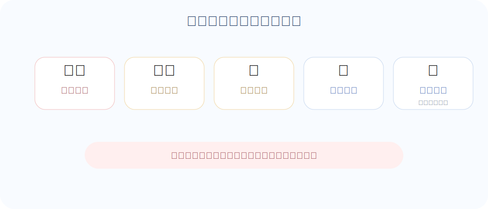

常见风险主要有五类。

### 1. 一本正经地编造

大模型可能会编出不存在的论文、作者、链接、法律条文、统计数据，甚至给出看起来很像真的引用。

所以，当你问它事实性问题时，最好要求它给出来源，并自己核验来源是否真实。

### 2. 把旧信息当成新信息

有些模型没有联网能力，有些模型的知识更新不及时。它可能不知道最新政策、最新产品价格、最新模型名称或最新公司动态。

如果问题和“当前时间”有关，最好使用可联网搜索的工具，或者自己查官方资料。

### 3. 数学和精确计算出错

大模型擅长解释数学思路，但不总是擅长精确计算。简单算术它也可能算错，复杂计算更应该交给计算器、电子表格或代码。

一个实用方法是：让模型写出计算过程，再用可靠工具验证结果。

### 4. 误解你的真实意图

如果你只说“帮我写一个方案”，它不知道你要商业方案、课程方案、活动方案，还是项目方案。

你越不提供背景，它越需要猜；猜得越多，答偏的概率越高。

### 5. 格式正确但内容错误

这是最容易迷惑人的地方。

大模型可以把错误内容写得非常整齐：有标题、有表格、有编号、有结论，看上去很专业。但形式好看不等于内容可靠。

因此，越重要的事情，越不要只问一次。

你可以让模型做这些自检：

```text
请检查你刚才的回答中，哪些部分是确定的，哪些部分需要进一步验证。
```

```text
请从反方角度质疑这个方案，指出它最可能失败的三个原因。
```

```text
请列出你回答中依赖的关键假设。如果这些假设不成立，结论会怎样变化？
```

这类追问能显著提高结果质量。

## 从“会用”到“用好”：下一步该学什么？

当你开始有意识地给背景、提要求、检查结果、继续追问时，你其实已经进入了 Prompt Engineering 的世界。

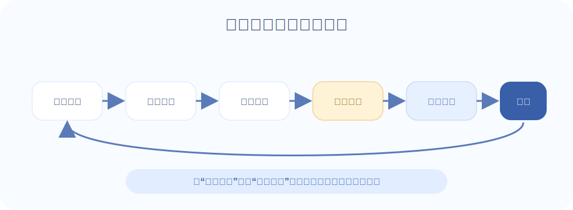

从这里往后，你可以继续学习几个更进阶的主题，帮助你建立对 Agent 的整体认知，并理解驱动 Agent 运转的大语言模型基础。如果你只是想要学会使用大模型，读到这里就可以了。

| 章节 | 内容 | 你将获得 |
|------|------|---------|
| **第1章** 什么是 Agent？ | Agent 的定义、架构、历史与应用场景 | 建立完整的概念框架 |
| **第2章** 大语言模型基础 | LLM 原理、Prompt Engineering、API 调用 | 熟练驾驭 Agent 的"大脑" |
---

*开始学习：[第1章 什么是 Agent？](./chapter_intro/README.md)*
